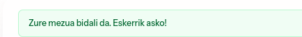

[ ] components field text
[ ] components tables
[ ] datatables
[ ] seo
[ ] acceesibilidad
[ ] traducciones repetidas
[ ] añadir el MCP para que consulte la documentación de laravel

[ ] dentro de la carpeta madaia33 buscar todos los ficheros y carpetas que sean del usuario root y ponerles amaia:amaia
[ ] añadir espacio para comercios
[ ] en los test todos los $this-> dan error en PROBLEMS
[ ] pasar pain no en modo test, dejarle a él que lo corrija
[ ] user hizkuntza, besdin du front-ekoa

# Copilot
[ ] Crear un nuevo agente, nombre sorgina con el icono de una brujita. Es una experta en PHP y LARAVEL, clean code, buenas prácticas, patrones de diseño DRY, YAGNI, KISS, SOLID... Su labor será revisar el código y buscar incongruencias y proponer soluciones con lo que encuentre. Funciona en modo "Plan" y luego pide confirmación para realizar los cambios. 
[ ] Crear una regla que guade en specs numeradas lo que le voy pidiendo y el plan de acción. Si hay errores, que añada los errores detectados y las correcciones.

# Home
[ ] Osatu pribatutasun-politika eta lege-oharrak testuak
[ ] Cookies sartu
[ ] Home: Anuncios a dos columnas
[ ] Iragarkiak: txukundu paginazioa 
[ ] Gallery: subtituluaren testua txukundu. Gehitu bukaeran homeko history-n jarri dugun txarteltxo bera argazkiak eskatzen.
[ ] Contact: subtitulua testua txukundu. 
[ ] Concact: al rellenar el formulario si todo ha ido bien dame un feedback más bonito, no esto 
[ ] Pribatua: añadir un bonito formulario de login, las funcionalidades las desarrollaremos más tarde. Solo el formulario que pida usuario (sera un texto), contraseña y la opción de cambiar contraseña

# Code
[ ] test en ingles
[ ] comments en ingles
[ ] cachear los settings para que reducir el número de consultas a la base de datos, cuando se modifica algun setting, borrar la cache y volver a crearla
[ ] Tabla para configurar el email desde el que se enviarán los mensajes con su testo legal. Modificar el envio de los mensajes del formulario de contacto para que use el que está configurado. Si es en local, en los devSeeders eliminar lo que haya en la tabla y crear un registro para usar mailhog
[ ] template de email compatible con los diferntes gestores de correo, que se use en el envio de correos. Incluido el texto legal que está configurado en la configuración del email
[ ] oganiza las carpetas views/components, views/livewire, view/layouts en admin y front y mueve los ficheros cada uno a su sitio. mira la carpeta partials y reorganizala, lo mismo con el dashboard.

# Panela
[?] En el panel, en mensajes, quita el testu "Mezu-sarrera"
En la lista de mesajes haz estos cambios:
- Mueve la columna irakurrita al principio y en vez de texto utiliza iconos. En los iconos añade la funcionalidad que hay en el texto justo antes de Ezabatu "Irakurrita markatu/Irakurri gabe markatu" y quita esta columna.
- En Ezabatu en texto, pon un icono.
- Al borrar pedir confirmación mediante un modal "bonito", reutiliza lo que hemos hecho en iragarkiak

## Txuletak
/dusk-test pasar los dusk test
pasar los test con coverage
