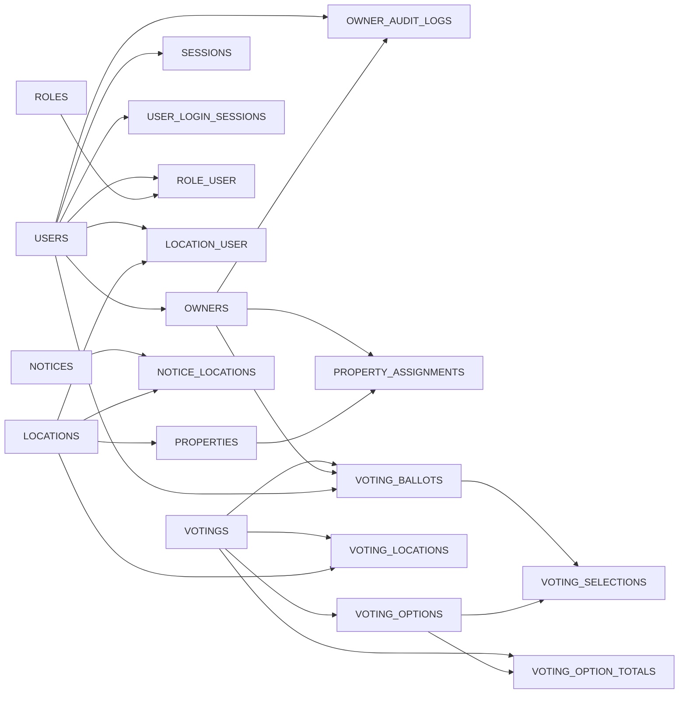
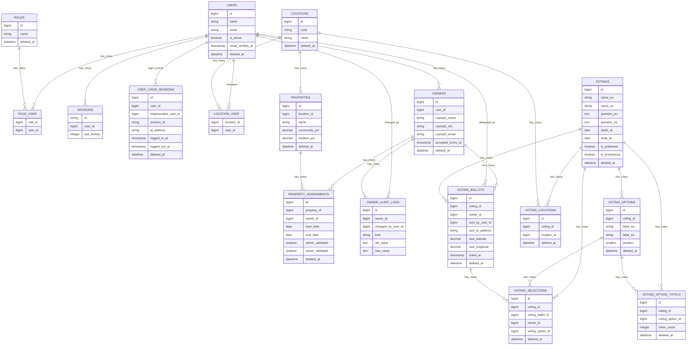
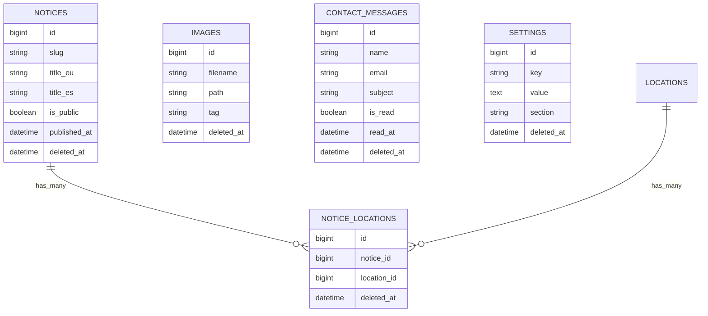
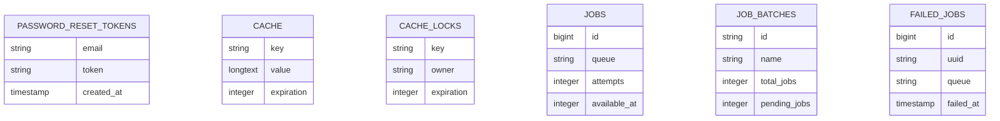

# Database Schema Mermaid

Use this skill to keep a single up-to-date Mermaid ER diagram for the current Laravel database schema.

## Source of truth

- Migrations under `database/migrations/` are the source of truth.
- Reflect table creates, key columns, and foreign key relations.
- If a migration changes table structure or relations, this skill file must be updated in the same change.

## Update workflow

1. Read all migrations in `database/migrations/`.
2. List entities (tables) and key columns:
    - primary key
    - foreign keys
    - business-critical columns (status, dates, unique keys)
3. Extract relations from `foreignId()->constrained()` and explicit foreign declarations.
4. Update the ER diagram below.
5. Validate Mermaid syntax before finishing.

## Mermaid ERD

### 1) Relational overview

### 2) Core domain (community ownership)

### 3) Content and settings domain

### 4) Framework tables

## Maintenance rule

If you add, remove, or modify any migration that changes tables, columns, unique keys, or foreign keys, update this skill in the same task.
