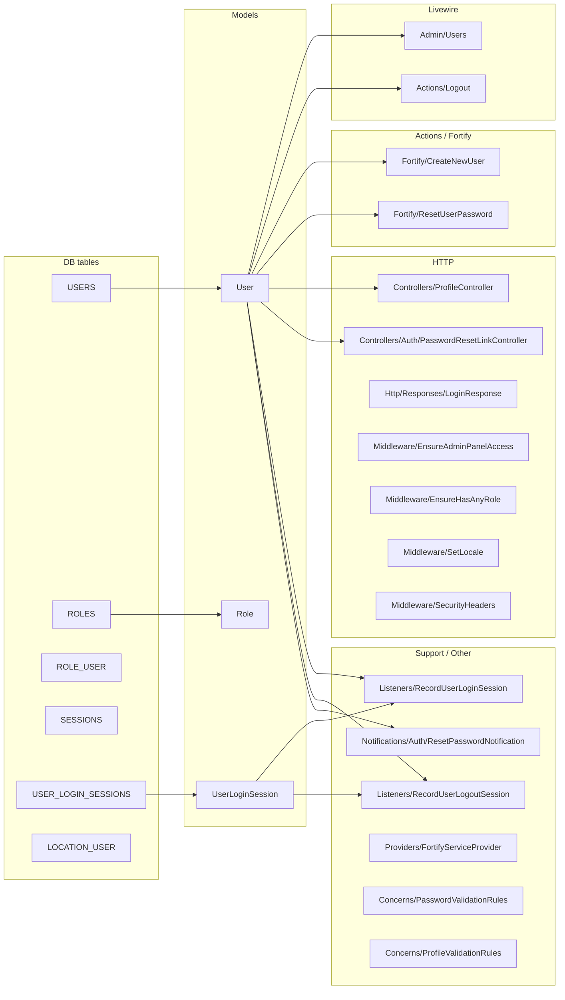

# Domain: Auth & access

Tables: `users`, `roles`, `role_user`, `sessions`, `user_login_sessions`, `location_user`

```mermaid
flowchart LR
    subgraph DB["DB tables"]
        USERS
        ROLES
        ROLE_USER
        SESSIONS
        USER_LOGIN_SESSIONS
        LOCATION_USER
    end

    subgraph MODELS["Models"]
        M_USER["User"]
        M_ROLE["Role"]
        M_ULS["UserLoginSession"]
    end

    subgraph LIVEWIRE["Livewire"]
        LW_USERS["Admin/Users"]
        LW_LOGOUT["Actions/Logout"]
    end

    subgraph ACTIONS["Actions / Fortify"]
        A_CREATE["Fortify/CreateNewUser"]
        A_RESET["Fortify/ResetUserPassword"]
    end

    subgraph HTTP["HTTP"]
        C_PROFILE["Controllers/ProfileController"]
        C_PWRESET["Controllers/Auth/PasswordResetLinkController"]
        R_LOGIN["Http/Responses/LoginResponse"]
        MW_ADMIN["Middleware/EnsureAdminPanelAccess"]
        MW_ROLE["Middleware/EnsureHasAnyRole"]
        MW_LOCALE["Middleware/SetLocale"]
        MW_SEC["Middleware/SecurityHeaders"]
    end

    subgraph SUPPORT["Support / Other"]
        N_RESET["Notifications/Auth/ResetPasswordNotification"]
        L_LOGIN["Listeners/RecordUserLoginSession"]
        L_LOGOUT["Listeners/RecordUserLogoutSession"]
        P_FORTIFY["Providers/FortifyServiceProvider"]
        C_PWD["Concerns/PasswordValidationRules"]
        C_PROF["Concerns/ProfileValidationRules"]
    end

    USERS --> M_USER
    ROLES --> M_ROLE
    USER_LOGIN_SESSIONS --> M_ULS

    M_USER --> LW_USERS
    M_USER --> LW_LOGOUT
    M_USER --> A_CREATE
    M_USER --> A_RESET
    M_USER --> C_PROFILE
    M_USER --> C_PWRESET
    M_USER --> L_LOGIN
    M_USER --> L_LOGOUT
    M_USER --> N_RESET
    M_ULS --> L_LOGIN
    M_ULS --> L_LOGOUT
```
