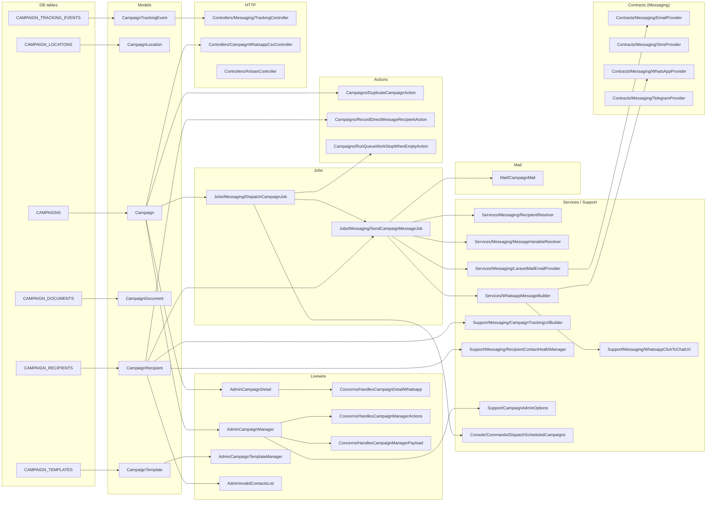

# Domain: Campaigns

Tables: `campaigns`, `campaign_locations`, `campaign_recipients`, `campaign_documents`, `campaign_tracking_events`, `campaign_templates`

```mermaid
flowchart LR
    subgraph DB["DB tables"]
        CAMPAIGNS
        CAMPAIGN_LOCATIONS
        CAMPAIGN_RECIPIENTS
        CAMPAIGN_DOCUMENTS
        CAMPAIGN_TRACKING_EVENTS
        CAMPAIGN_TEMPLATES
    end

    subgraph MODELS["Models"]
        M_C["Campaign"]
        M_CL["CampaignLocation"]
        M_CR["CampaignRecipient"]
        M_CD["CampaignDocument"]
        M_CTE["CampaignTrackingEvent"]
        M_CT["CampaignTemplate"]
    end

    subgraph LIVEWIRE["Livewire"]
        LW_MGR["AdminCampaignManager"]
        LW_DETAIL["AdminCampaignDetail"]
        LW_TPL["AdminCampaignTemplateManager"]
        LW_INVALID["AdminInvalidContactsList"]
        C_WA["Concerns/HandlesCampaignDetailWhatsapp"]
        C_ACT["Concerns/HandlesCampaignManagerActions"]
        C_PAY["Concerns/HandlesCampaignManagerPayload"]
    end

    subgraph JOBS["Jobs"]
        J_DISPATCH["Jobs/Messaging/DispatchCampaignJob"]
        J_SEND["Jobs/Messaging/SendCampaignMessageJob"]
    end

    subgraph ACTIONS["Actions"]
        A_DUP["Campaigns/DuplicateCampaignAction"]
        A_DM["Campaigns/RecordDirectMessageRecipientAction"]
        A_QUEUE["Campaigns/RunQueueWorkStopWhenEmptyAction"]
    end

    subgraph HTTP["HTTP"]
        C_TRACK["Controllers/Messaging/TrackingController"]
        C_WA_CSV["Controllers/CampaignWhatsappCsvController"]
        C_ART["Controllers/ArtisanController"]
    end

    subgraph SERVICES["Services / Support"]
        S_RES["Services/Messaging/RecipientResolver"]
        S_MSG["Services/Messaging/MessageVariableResolver"]
        S_EMAIL["Services/Messaging/LaravelMailEmailProvider"]
        S_WA["Services/WhatsappMessageBuilder"]
        S_TRACK["Support/Messaging/CampaignTrackingUrlBuilder"]
        S_HEALTH["Support/Messaging/RecipientContactHealthManager"]
        S_WAURL["Support/Messaging/WhatsappClickToChatUrl"]
        S_OPTS["Support/CampaignAdminOptions"]
        CMD_SCHED["Console/Commands/DispatchScheduledCampaigns"]
    end

    subgraph CONTRACTS["Contracts (Messaging)"]
        I_EMAIL["Contracts/Messaging/EmailProvider"]
        I_SMS["Contracts/Messaging/SmsProvider"]
        I_WA["Contracts/Messaging/WhatsAppProvider"]
        I_TG["Contracts/Messaging/TelegramProvider"]
    end

    subgraph MAIL["Mail"]
        MAIL_C["Mail/CampaignMail"]
    end

    CAMPAIGNS --> M_C
    CAMPAIGN_LOCATIONS --> M_CL
    CAMPAIGN_RECIPIENTS --> M_CR
    CAMPAIGN_DOCUMENTS --> M_CD
    CAMPAIGN_TRACKING_EVENTS --> M_CTE
    CAMPAIGN_TEMPLATES --> M_CT

    M_C --> LW_MGR
    M_C --> LW_DETAIL
    M_CT --> LW_TPL
    M_CR --> LW_INVALID
    LW_DETAIL --> C_WA
    LW_MGR --> C_ACT
    LW_MGR --> C_PAY

    M_C --> J_DISPATCH
    M_CR --> J_SEND
    J_DISPATCH --> J_SEND

    M_C --> A_DUP
    M_CR --> A_DM
    J_DISPATCH --> A_QUEUE

    M_CTE --> C_TRACK
    M_C --> C_WA_CSV
    J_DISPATCH --> CMD_SCHED

    J_SEND --> S_RES
    J_SEND --> S_MSG
    J_SEND --> S_EMAIL
    J_SEND --> S_WA
    M_CR --> S_TRACK
    M_CR --> S_HEALTH
    S_WA --> S_WAURL
    LW_MGR --> S_OPTS

    S_EMAIL --> I_EMAIL
    S_WA --> I_WA

    J_SEND --> MAIL_C
```
