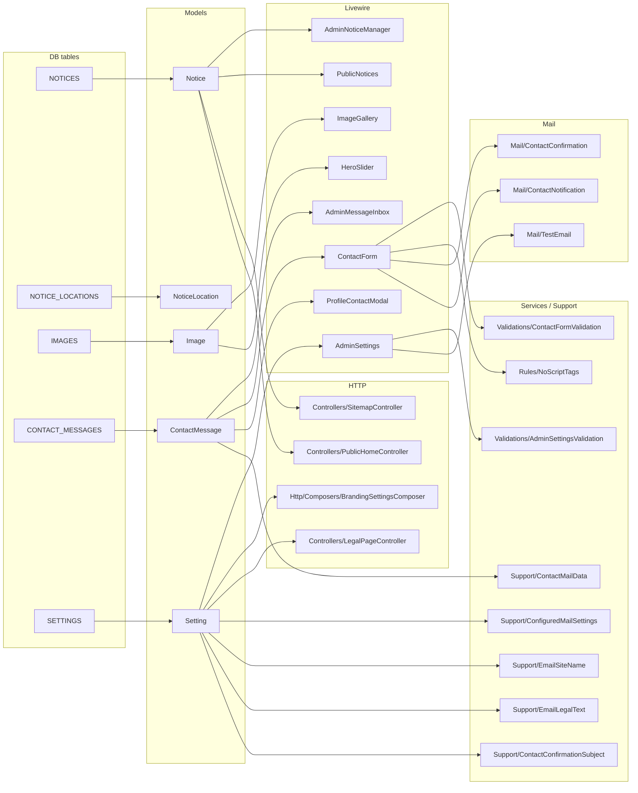

# Domain: Content & settings

Tables: `notices`, `notice_locations`, `images`, `contact_messages`, `settings`

```mermaid
flowchart LR
    subgraph DB["DB tables"]
        NOTICES
        NOTICE_LOCATIONS
        IMAGES
        CONTACT_MESSAGES
        SETTINGS
    end

    subgraph MODELS["Models"]
        M_N["Notice"]
        M_NL["NoticeLocation"]
        M_IMG["Image"]
        M_CM["ContactMessage"]
        M_SET["Setting"]
    end

    subgraph LIVEWIRE["Livewire"]
        LW_NOTICE["AdminNoticeManager"]
        LW_MSG["AdminMessageInbox"]
        LW_SET["AdminSettings"]
        LW_PUB["PublicNotices"]
        LW_GALLERY["ImageGallery"]
        LW_SLIDER["HeroSlider"]
        LW_CONTACT["ContactForm"]
        LW_PROFILE["ProfileContactModal"]
    end

    subgraph HTTP["HTTP"]
        C_HOME["Controllers/PublicHomeController"]
        C_LEGAL["Controllers/LegalPageController"]
        C_SITEMAP["Controllers/SitemapController"]
        COMP_BRAND["Http/Composers/BrandingSettingsComposer"]
    end

    subgraph SERVICES["Services / Support"]
        V_SETTINGS["Validations/AdminSettingsValidation"]
        V_CONTACT["Validations/ContactFormValidation"]
        S_MAILCFG["Support/ConfiguredMailSettings"]
        S_SITE["Support/EmailSiteName"]
        S_LEGAL["Support/EmailLegalText"]
        S_SUBJ["Support/ContactConfirmationSubject"]
        S_DATA["Support/ContactMailData"]
        R_NO_SCRIPT["Rules/NoScriptTags"]
    end

    subgraph MAIL["Mail"]
        MAIL_CONF["Mail/ContactConfirmation"]
        MAIL_NOTIF["Mail/ContactNotification"]
        MAIL_TEST["Mail/TestEmail"]
    end

    NOTICES --> M_N
    NOTICE_LOCATIONS --> M_NL
    IMAGES --> M_IMG
    CONTACT_MESSAGES --> M_CM
    SETTINGS --> M_SET

    M_N --> LW_NOTICE
    M_N --> LW_PUB
    M_CM --> LW_MSG
    M_SET --> LW_SET
    M_IMG --> LW_GALLERY
    M_IMG --> LW_SLIDER
    M_CM --> LW_CONTACT
    M_CM --> LW_PROFILE

    M_SET --> COMP_BRAND
    M_N --> C_SITEMAP
    M_N --> C_HOME
    M_SET --> C_LEGAL

    LW_SET --> V_SETTINGS
    LW_CONTACT --> V_CONTACT
    LW_CONTACT --> R_NO_SCRIPT
    M_SET --> S_MAILCFG
    M_SET --> S_SITE
    M_SET --> S_LEGAL
    M_SET --> S_SUBJ
    M_CM --> S_DATA

    LW_CONTACT --> MAIL_CONF
    LW_CONTACT --> MAIL_NOTIF
    LW_SET --> MAIL_TEST
```
