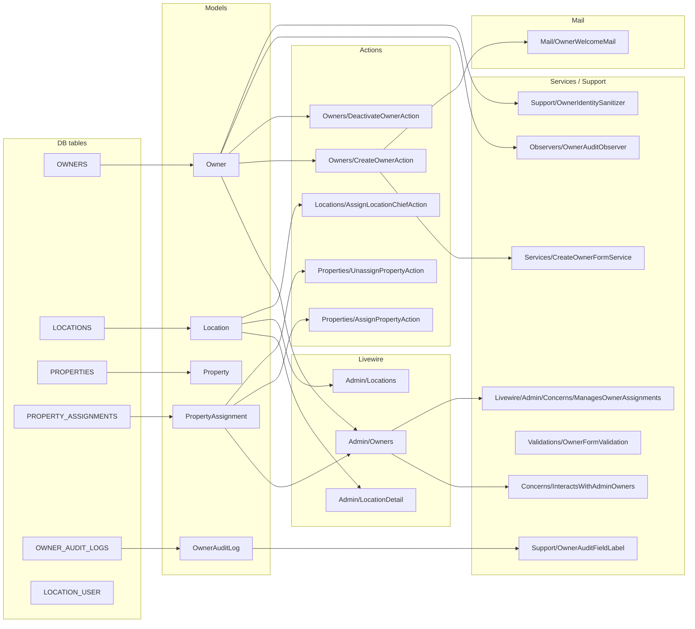

# Domain: Ownership

Tables: `owners`, `locations`, `properties`, `property_assignments`, `owner_audit_logs`, `location_user`

```mermaid
flowchart LR
    subgraph DB["DB tables"]
        OWNERS
        LOCATIONS
        PROPERTIES
        PROPERTY_ASSIGNMENTS
        OWNER_AUDIT_LOGS
        LOCATION_USER
    end

    subgraph MODELS["Models"]
        M_OWNER["Owner"]
        M_LOC["Location"]
        M_PROP["Property"]
        M_PA["PropertyAssignment"]
        M_OAL["OwnerAuditLog"]
    end

    subgraph LIVEWIRE["Livewire"]
        LW_OWNERS["Admin/Owners"]
        LW_LOCD["Admin/LocationDetail"]
        LW_LOCS["Admin/Locations"]
    end

    subgraph ACTIONS["Actions"]
        A_CREATE["Owners/CreateOwnerAction"]
        A_DEACT["Owners/DeactivateOwnerAction"]
        A_ASSIGN["Properties/AssignPropertyAction"]
        A_UNASSIGN["Properties/UnassignPropertyAction"]
        A_CHIEF["Locations/AssignLocationChiefAction"]
    end

    subgraph SERVICES["Services / Support"]
        S_FORM["Services/CreateOwnerFormService"]
        S_AUDIT["Observers/OwnerAuditObserver"]
        S_SANITIZE["Support/OwnerIdentitySanitizer"]
        S_AUDITLBL["Support/OwnerAuditFieldLabel"]
        V_OWNER["Validations/OwnerFormValidation"]
        C_OWNERS["Concerns/InteractsWithAdminOwners"]
        C_ASSIGN["Livewire/Admin/Concerns/ManagesOwnerAssignments"]
    end

    subgraph MAIL["Mail"]
        MAIL_WELCOME["Mail/OwnerWelcomeMail"]
    end

    OWNERS --> M_OWNER
    LOCATIONS --> M_LOC
    PROPERTIES --> M_PROP
    PROPERTY_ASSIGNMENTS --> M_PA
    OWNER_AUDIT_LOGS --> M_OAL

    M_OWNER --> LW_OWNERS
    M_LOC --> LW_LOCD
    M_LOC --> LW_LOCS
    M_PA --> LW_OWNERS

    M_OWNER --> A_CREATE
    M_OWNER --> A_DEACT
    M_PA --> A_ASSIGN
    M_PA --> A_UNASSIGN
    M_LOC --> A_CHIEF

    A_CREATE --> S_FORM
    M_OWNER --> S_AUDIT
    M_OWNER --> S_SANITIZE
    M_OAL --> S_AUDITLBL
    A_CREATE --> MAIL_WELCOME
    LW_OWNERS --> C_OWNERS
    LW_OWNERS --> C_ASSIGN
```
