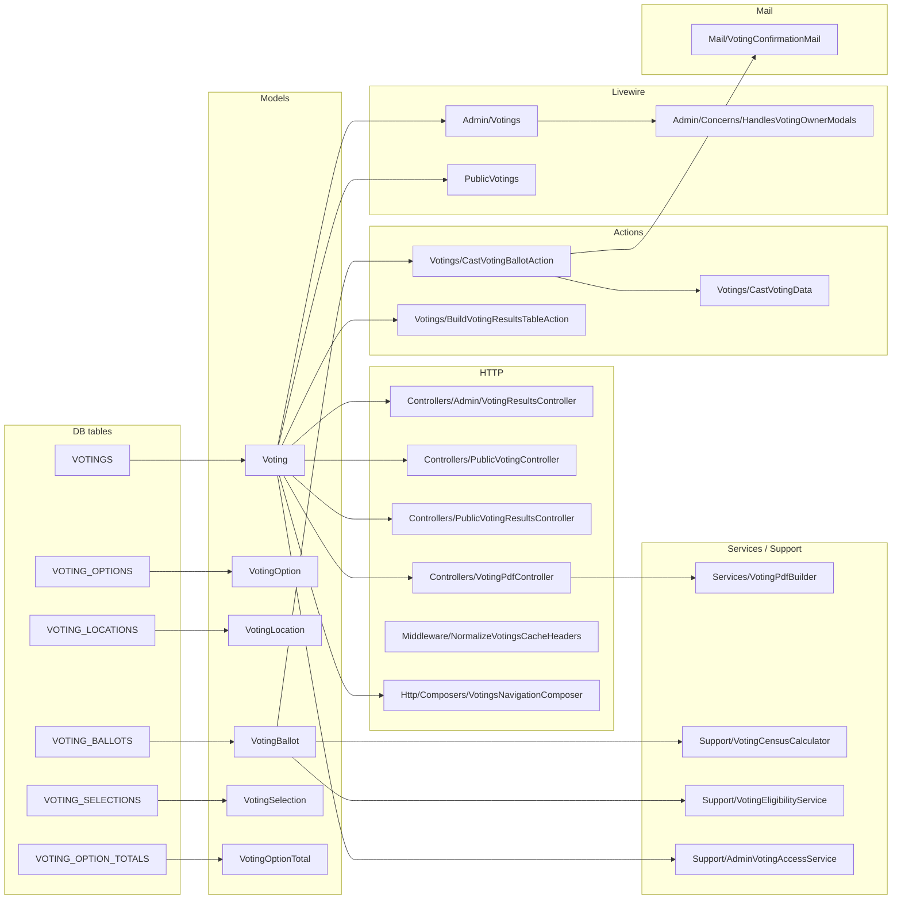

# Domain: Votings

Tables: `votings`, `voting_options`, `voting_locations`, `voting_ballots`, `voting_selections`, `voting_option_totals`

```mermaid
flowchart LR
    subgraph DB["DB tables"]
        VOTINGS
        VOTING_OPTIONS
        VOTING_LOCATIONS
        VOTING_BALLOTS
        VOTING_SELECTIONS
        VOTING_OPTION_TOTALS
    end

    subgraph MODELS["Models"]
        M_V["Voting"]
        M_VO["VotingOption"]
        M_VL["VotingLocation"]
        M_VB["VotingBallot"]
        M_VS["VotingSelection"]
        M_VOT["VotingOptionTotal"]
    end

    subgraph LIVEWIRE["Livewire"]
        LW_ADM["Admin/Votings"]
        LW_PUB["PublicVotings"]
        C_MODALS["Admin/Concerns/HandlesVotingOwnerModals"]
    end

    subgraph ACTIONS["Actions"]
        A_CAST["Votings/CastVotingBallotAction"]
        A_DATA["Votings/CastVotingData"]
        A_TABLE["Votings/BuildVotingResultsTableAction"]
    end

    subgraph HTTP["HTTP"]
        C_ADMIN["Controllers/Admin/VotingResultsController"]
        C_PUB["Controllers/PublicVotingController"]
        C_PUBRES["Controllers/PublicVotingResultsController"]
        C_PDF["Controllers/VotingPdfController"]
        MW_CACHE["Middleware/NormalizeVotingsCacheHeaders"]
        COMP_NAV["Http/Composers/VotingsNavigationComposer"]
    end

    subgraph SERVICES["Services / Support"]
        S_PDF["Services/VotingPdfBuilder"]
        S_CENSUS["Support/VotingCensusCalculator"]
        S_ELIG["Support/VotingEligibilityService"]
        S_ACCESS["Support/AdminVotingAccessService"]
    end

    subgraph MAIL["Mail"]
        MAIL_CONF["Mail/VotingConfirmationMail"]
    end

    VOTINGS --> M_V
    VOTING_OPTIONS --> M_VO
    VOTING_LOCATIONS --> M_VL
    VOTING_BALLOTS --> M_VB
    VOTING_SELECTIONS --> M_VS
    VOTING_OPTION_TOTALS --> M_VOT

    M_V --> LW_ADM
    M_V --> LW_PUB
    LW_ADM --> C_MODALS

    M_VB --> A_CAST
    A_CAST --> A_DATA
    M_V --> A_TABLE

    M_V --> C_ADMIN
    M_V --> C_PUB
    M_V --> C_PUBRES
    M_V --> C_PDF
    M_V --> COMP_NAV

    C_PDF --> S_PDF
    M_VB --> S_CENSUS
    M_VB --> S_ELIG
    M_V --> S_ACCESS

    A_CAST --> MAIL_CONF
```
