# unificar diseño en el panel de control

**IMPORTANTE** tomar cómo ejemplo de estilo el listado y el formulario de avisos y el listado de galería y el listado de mensajes

## Listado

### Encabezado
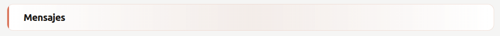

### Breadcrumb
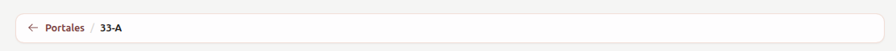

### Formato de los botones para crear un nuevo registro

### Formato de los encabezados de las tablas
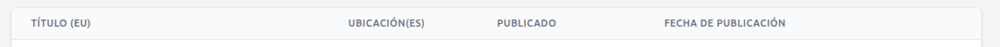

### Formato del botón editar + tiene un hover

Se desplazará desde la derecha el formulario correspondiente

### Formato del botón para abrir una sub-lista

### Formato del botón borrar + tiene un hover

Antes de borrar siempre pedirá confirmación
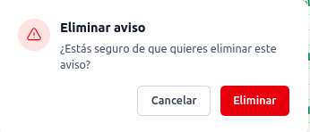

### Enlaces en las tablas que cabian el valor de un campo (normalente tienen un href o un wire:click) + tiene un hover
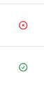
Antes de cambiar siempre pedirá confirmación

### Filtro del listado tipo input
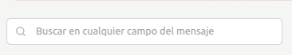

### Filtros del listado tipo botones
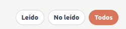

### Paginación
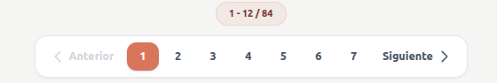

## Formulario

### Formato de los campos input text bilingües
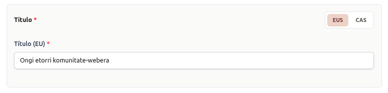

### Formato de los campos textarea con mini editor bilingües
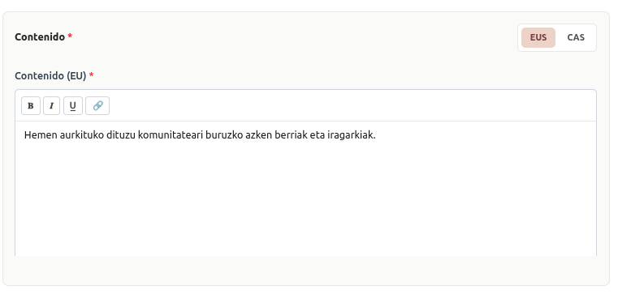

### Formato de los campos de selección múltiple
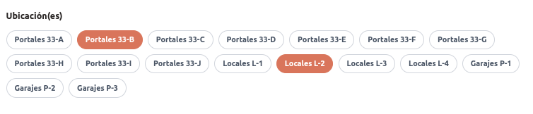

### Formato de los campos si/no
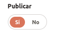

### Formato de los botones de un formulario
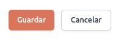

### Formato de los campos para subir ficheros
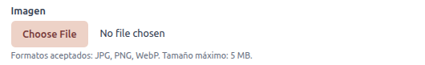

### Formato de los campoos input text simples
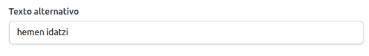

### Formato de los campos de selección simple cuando sean menos de 5 elementos

