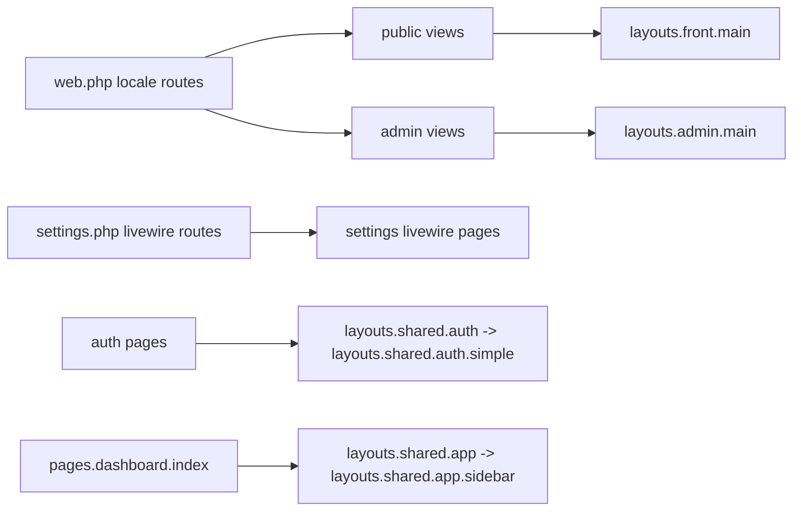
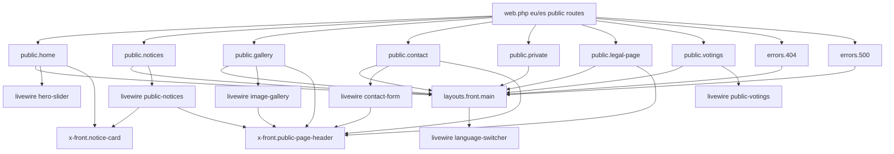
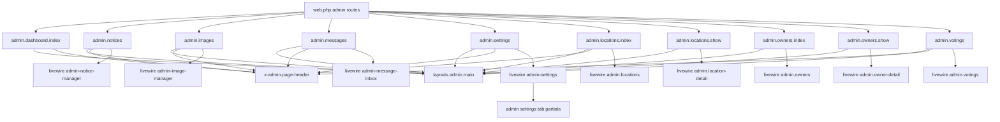
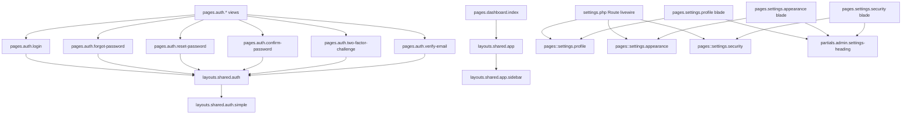
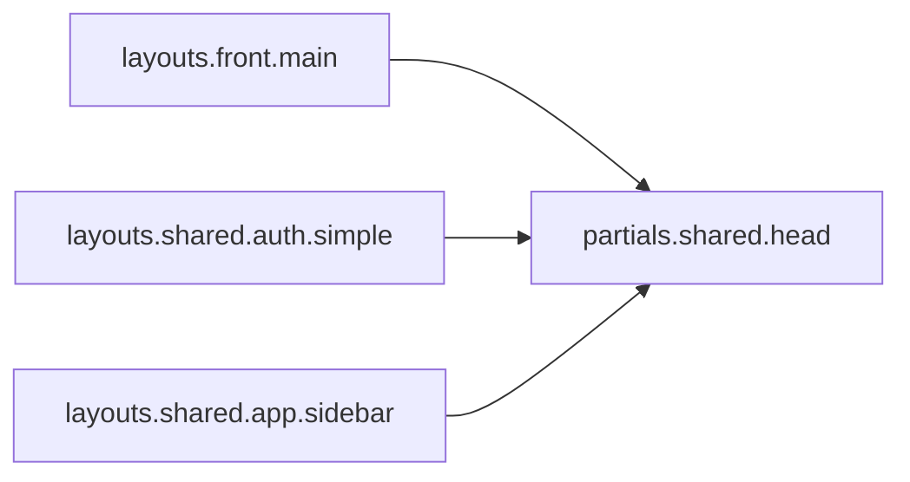

# Views Structure Mermaid

Use this skill to keep a single up-to-date Mermaid map of view architecture for this Laravel app.

## Source of truth

- Route entry points in `routes/web.php` and `routes/settings.php`.
- Blade templates in `resources/views/**`.
- Layout usage (`<x-layouts::...>`), includes (`@include(...)`), and Blade components (`<x-...>`).
- Livewire mounts in Blade (`<livewire:...>` and `Route::livewire(...)`).

## Update workflow

1. Read route files and list each route-to-view or route-to-livewire entry point.
2. Read affected Blade files and extract layout, include, component, and Livewire relations.
3. Update the Mermaid graph below.
4. Validate Mermaid syntax before finishing.

## Mermaid Views Map

### 1) Public routes, views and components

### 2) Admin routes, views and Livewire mounts

### 3) Auth, dashboard and settings pages

### 4) Shared layout partials

## Maintenance rule

If you add or modify any route that renders a view/livewire component, or change any Blade layout/include/component relation in `resources/views/**`, update this skill in the same task.
