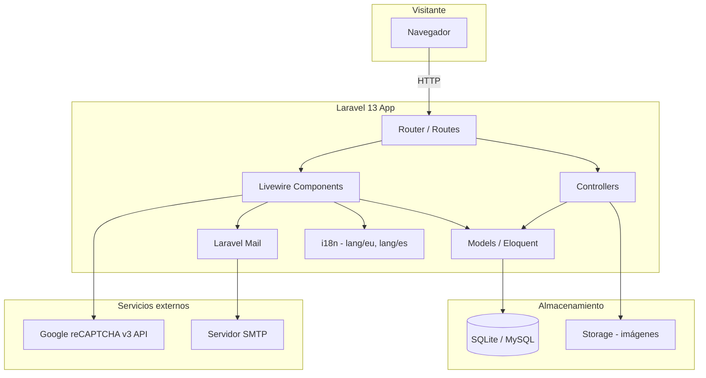
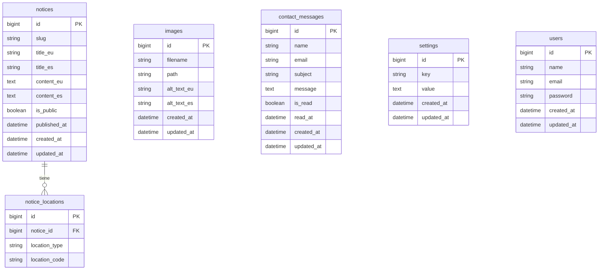
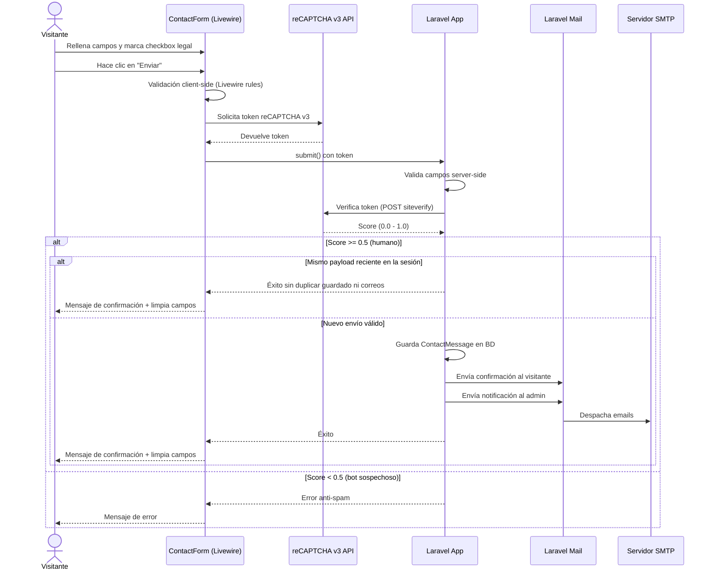

# Documento de Diseño Técnico — community-web

## Visión General

La web de la comunidad de vecinos es una aplicación Laravel 13 con arquitectura monolítica clásica (server-side rendering) enriquecida con componentes Livewire para la interactividad sin recarga de página. La parte pública es accesible sin autenticación y ofrece avisos, galería de imágenes y formulario de contacto en Euskera (por defecto) y Castellano. El panel de administración está protegido por autenticación y permite gestionar todos los contenidos. La parte privada para vecinos queda como placeholder para desarrollo futuro.

### Decisiones de diseño clave

- **Entorno de desarrollo**: Docker con la imagen `webdevops/php-apache-dev:8.4` (sin Laravel Sail). El fichero `docker-compose.yml` monta el proyecto en `/docker` dentro del contenedor y expone Apache. Los comandos del proyecto se ejecutan dentro del contenedor con `docker compose run --rm madaia33 <comando>` o `docker compose exec madaia33 <comando>` cuando el servicio ya está levantado.
- **Base de datos**: La aplicación mantiene soporte para SQLite y MySQL/MariaDB. En tests se usa SQLite en memoria y el entorno Docker del proyecto incluye un servicio MariaDB para ejecución local.
- **Internacionalización**: Sistema nativo de Laravel (`lang/` + helpers `__()` / `trans()`), con archivos de traducción para `eu` (Euskera) y `es` (Castellano). El locale se persiste en sesión.
- **Anti-spam**: reCAPTCHA v3 de Google. La clave pública/privada se configura desde el panel de administración y se almacena en la tabla `settings`.
- **Envío de emails**: Laravel Mail con driver configurable (SMTP, Mailgun, etc.). Las notificaciones se implementan con `Mailable` classes.
- **Almacenamiento de imágenes**: disco `public` de Laravel Storage (`storage/app/public`), con enlace simbólico `public/storage`.
- **Tests de navegador**: Laravel Dusk con ChromeDriver para tests end-to-end de flujos críticos de usuario.
- **Tests de navegador**: Laravel Dusk con ChromeDriver para tests end-to-end de flujos críticos de usuario. Además de los tests específicos por pantalla, existe una suite smoke `PublicSiteResponsiveTest` que valida los flujos públicos principales en mobile y landscape.
- **SMTP de pruebas para browser tests**: En los flujos Dusk del formulario de contacto, el entorno Docker puede apuntar `MAIL_HOST=mailhog` y `MAIL_PORT=1025` para comprobar entrega real de emails sin depender de `Mail::fake()`.
- **SEO**: Cada vista Blade pública usa un stack de Blade (`@stack('meta')`) para inyectar título y meta description únicos por página en el idioma activo. Se genera un `sitemap.xml` dinámico mediante una ruta dedicada y un controlador.
- **Seguridad**: Cabeceras HTTP de seguridad (`X-Frame-Options`, `X-Content-Type-Options`, `Referrer-Policy`) añadidas mediante middleware. Protección CSRF nativa de Laravel activa en todos los formularios. HTTPS obligatorio en producción mediante configuración de `AppServiceProvider` o `.env`.
- **Validación defensiva en contacto**: El formulario de contacto rechaza entradas que incluyen etiquetas `<script>` en asunto o mensaje mediante reglas de validación específicas (`not_regex`), como capa adicional frente a XSS, manteniendo además el escape de salida en Blade.
- **Anti-duplicado en contacto**: `ContactForm` mantiene durante 15 segundos una huella del payload enviado en la sesión actual para ignorar dobles clics rápidos o reenvíos inmediatos del mismo mensaje sin duplicar persistencia ni correos.
- **Paginación**: Los avisos se paginan a 10 por página usando el paginador de Laravel/Livewire. Las imágenes se muestran en grid sin paginación pero con lazy loading.
- **Filtrado público**: El componente `PublicNotices` expone un selector de portal/planta que filtra los avisos en tiempo real mediante Livewire. La galería pública de imágenes no filtra por ubicación en el estado actual del código.
- **Seeders de desarrollo**: `DevSeeder` genera datos de prueba realistas (avisos con y sin traducción, imágenes, mensajes de contacto leídos y no leídos). `DatabaseSeeder` lo invoca condicionalmente con `if (app()->isLocal())`, de modo que nunca se ejecuta en producción ni en el entorno de test Dusk (que usa `APP_ENV=testing`).

---

## Entorno de Desarrollo (Docker)

> ⚠️ **IMPORTANTE**: El sistema host puede tener una versión de PHP distinta (p.ej. 8.1). **Nunca ejecutes `php artisan`, `composer` ni `npm` directamente en el host.** Todos los comandos deben lanzarse dentro del contenedor con `docker compose exec madaia33 <comando>`, donde corre PHP 8.4.

El proyecto usa Docker sin Laravel Sail. El `docker-compose.yml` ya existe en la raíz del workspace con la siguiente configuración:

```yaml
version: "3.9"

services:
  madaia33:
    image: webdevops/php-apache-dev:${DC_PHP:-8.4}
    user: "${DC_UID:-1000}:${DC_GID:-1000}"
    volumes:
      - ./:/docker
      - ./vendor:/vendor
    working_dir: /docker
    environment:
      - PATH=$PATH:/home/application/.composer/vendor/bin:/home/application/.config/composer/vendor/bin
    networks:
      - frontend

networks:
  frontend: null
```

### Arrancar el entorno

```bash
docker compose up -d
```

### Crear el proyecto Laravel 13

```bash
docker compose exec madaia33 composer create-project laravel/laravel . "^13"
```

### Comandos habituales dentro del contenedor

```bash
# Artisan
docker compose exec madaia33 php artisan migrate

# Composer
docker compose exec madaia33 composer require livewire/livewire

# npm (si se necesita compilar assets)
docker compose exec madaia33 npm install
docker compose exec madaia33 npm run build
```

### Variables de entorno

Copiar `.env.example` a `.env` y ajustar:

```env
APP_URL=http://localhost
DB_CONNECTION=sqlite
# En el entorno Docker del proyecto también puede usarse MariaDB/MySQL cambiando la configuración correspondiente.
```

El usuario y grupo del contenedor se configuran mediante las variables `DC_UID` y `DC_GID` en un archivo `.env` en la raíz (o exportándolas en la shell) para que coincidan con el usuario del host y evitar problemas de permisos en los volúmenes montados.

---

## Arquitectura



### Capas de la aplicación

| Capa                 | Tecnología                     | Responsabilidad                                                                      |
| -------------------- | ------------------------------ | ------------------------------------------------------------------------------------ |
| Routing              | Laravel Router                 | Definición de rutas públicas, admin y privadas                                       |
| Presentación         | Blade + Livewire + TailwindCSS | Vistas, componentes reactivos, estilos                                               |
| Lógica de negocio    | Livewire Components + Actions  | Flujo de formularios, gestión de estado, coordinación con validaciones reutilizables |
| Persistencia         | Eloquent ORM                   | Acceso a base de datos                                                               |
| Internacionalización | Laravel Lang                   | Traducciones EU/ES                                                                   |
| Email                | Laravel Mail (Mailable)        | Confirmación al visitante + notificación al admin                                    |
| Anti-spam            | reCAPTCHA v3                   | Protección del formulario de contacto                                                |
| Autenticación        | Laravel Breeze (solo admin)    | Acceso al panel de administración                                                    |

---

## Componentes e Interfaces

### Rutas

```
GET  /                          → Página principal (avisos destacados + acceso galería)
GET  /avisos                    → Lista completa de avisos públicos
GET  /galeria                   → Galería de imágenes
GET  /contacto                  → Formulario de contacto
GET  /privado                   → Placeholder parte privada con CTA a login para usuarios no autenticados

GET  /admin                     → Dashboard admin (requiere auth)
GET  /admin/avisos              → Gestión de avisos
GET  /admin/avisos/crear        → Crear aviso
GET  /admin/avisos/{id}/editar  → Editar aviso
DELETE /admin/avisos/{id}       → Eliminar aviso

GET  /admin/imagenes            → Gestión de imágenes

GET  /admin/mensajes            → Bandeja de mensajes de contacto
GET  /admin/mensajes/{id}       → Ver mensaje
DELETE /admin/mensajes/{id}     → Eliminar mensaje

GET  /admin/configuracion       → Configuración general (email admin, reCAPTCHA, texto legal)

GET  /politica-de-privacidad    → Página de política de privacidad (pública)
GET  /aviso-legal               → Página de aviso legal (pública)
GET  /sitemap.xml               → Sitemap XML (pública)
GET  /robots.txt                → Robots.txt (pública)

GET  /admin/paginas-legales     → Edición de páginas legales (admin)

GET  /login                     → Login admin
POST /login                     → Autenticar
POST /logout                    → Cerrar sesión
```

### Componentes Livewire principales

| Componente           | Ruta                     | Responsabilidad                                                                   |
| -------------------- | ------------------------ | --------------------------------------------------------------------------------- |
| `PublicNotices`      | `/avisos`                | Lista paginada de avisos públicos con filtro por portal/planta                    |
| `HeroSlider`         | `/`                      | Carrusel principal de la home con autoplay coordinado por eventos Alpine/Livewire |
| `ImageGallery`       | `/galeria`               | Galería con lightbox ordenada por fecha                                           |
| `ContactForm`        | `/contacto`              | Formulario con validación en tiempo real, reCAPTCHA v3, envío de emails           |
| `LanguageSwitcher`   | Global (layout)          | Cambio de idioma EU/ES, persiste en sesión                                        |
| `AdminNoticeManager` | `/admin/avisos`          | CRUD de avisos con publicación/despublicación                                     |
| `AdminMessageInbox`  | `/admin/mensajes`        | Bandeja de mensajes, marcar leído/no leído, eliminar con confirmación             |
| `AdminSettings`      | `/admin/configuracion`   | Configuración de email, reCAPTCHA, texto legal                                    |
| `AdminLegalPages`    | `/admin/paginas-legales` | Edición de contenido de política de privacidad y aviso legal en EU y ES           |

La ruta `/admin/imagenes` y su vista existen, pero el componente dedicado de gestión administrativa de imágenes sigue pendiente en el estado actual del código.

### Layouts Blade

- `layouts/public.blade.php` — Layout para la parte pública (nav con selector de idioma, footer)
- `layouts/admin.blade.php` — Layout para el panel de administración (sidebar, nav admin)
- `public/legal-page.blade.php` — Plantilla pública reutilizable para política de privacidad y aviso legal; cambia solo la clave de título, el slug expuesto en `data-legal-page` y el contenido cargado desde `settings`

### Convenciones de testing UI implementadas

- Las vistas públicas exponen atributos `data-*` estables para Dusk y Feature tests en puntos clave (`data-hero-slider`, `data-latest-notices`, `data-notices-grid`, `data-notices-filter`, `data-gallery-grid`, `data-gallery-lightbox`).
- Las páginas públicas de primer nivel exponen marcadores semánticos (`data-page` y `data-page-hero`) para reducir la dependencia de asserts basados en cadenas largas de clases Tailwind.
- La home incorpora accesos rápidos estables (`data-home-quick-links`) hacia avisos, galería y contacto para mejorar descubrimiento de contenido.
- Las metadescripciones públicas se definen por locale en los ficheros de traducción (`home.seo_description`, `notices.seo_description`, `gallery.seo_description`, `contact.seo_description` y claves legales/privadas de `general`).
- El formulario de contacto muestra microfeedback de completitud (contadores de asunto/mensaje) y estado de envío accesible con `aria-live`.
- El hero slider público soporta interacción táctil en móvil (swipe izquierda/derecha) además de botones de navegación.
- Las páginas legales públicas exponen `data-legal-page="privacy-policy|legal-notice"` para validar la plantilla compartida sin depender de texto duplicado.
- El menú móvil público usa `x-cloak` y altura máxima con scroll para que los tests landscape y la UX móvil no dependan del tiempo de inicialización de Alpine.
- La comprobación E2E del formulario de contacto en navegador valida el flujo visible, incluido el bloqueo inmediato del botón de envío frente a doble clic rápido.
- La deduplicación de persistencia y correos del formulario de contacto se cubre con tests de Feature sobre `ContactForm`.

---

## Modelos de Datos

### Esquema de base de datos



### Descripción de tablas

**`notices`** — Avisos de la comunidad

- `title_eu` / `title_es`: título en cada idioma
- `content_eu` / `content_es`: contenido en cada idioma (texto enriquecido)
- `is_public`: controla visibilidad en la parte pública
- `published_at`: fecha de publicación visible

**`notice_locations`** — Asociación de contenido a portales/plantas

- `location_type`: `portal` | `garage`
- `location_code`: `33-A`–`33-J` para portales, `P-1`–`P-3` para garajes

**`contact_messages`** — Mensajes recibidos por el formulario de contacto

- `is_read`: estado de lectura
- `read_at`: timestamp de primera lectura

**`settings`** — Configuración clave-valor del sistema

- Claves previstas: `admin_email`, `recaptcha_site_key`, `recaptcha_secret_key`, `legal_checkbox_text_eu`, `legal_checkbox_text_es`, `legal_url`, `legal_page_privacy_policy_eu`, `legal_page_privacy_policy_es`, `legal_page_legal_notice_eu`, `legal_page_legal_notice_es`

**`users`** — Solo administradores (sin roles complejos en esta fase)

### Modelos Eloquent

```
App\Models\Notice
App\Models\Image
App\Models\NoticeLocation
App\Models\ContactMessage
App\Models\Setting
App\Models\User
```

---

## Internacionalización (i18n)

Laravel gestiona las traducciones mediante archivos en `lang/eu/` y `lang/es/`. El locale activo se almacena en sesión y se aplica en cada request mediante un middleware.

### Estructura de archivos de traducción

```
lang/
  eu/
    general.php      ← textos de navegación, botones, mensajes generales
    notices.php      ← textos de la sección de avisos
    gallery.php      ← textos de la galería
    contact.php      ← textos y validaciones del formulario de contacto
    admin.php        ← textos del panel de administración
  es/
    general.php
    notices.php
    gallery.php
    contact.php
    admin.php
```

### Middleware de idioma

```php
// app/Http/Middleware/SetLocale.php
public function handle(Request $request, Closure $next): Response
{
    $locale = $request->session()->get('locale', 'eu');
    if (!in_array($locale, ['eu', 'es'])) {
        $locale = 'eu';
    }
    App::setLocale($locale);
    return $next($request);
}
```

El componente Livewire `LanguageSwitcher` llama a una acción que guarda el locale en sesión y recarga la página.

### Contenido bilingüe en base de datos

Los avisos e imágenes almacenan el contenido en columnas separadas por idioma (`title_eu`, `title_es`, etc.). Los modelos exponen un accessor `title` que devuelve el campo del locale activo:

```php
public function getTitleAttribute(): string
{
    $locale = App::getLocale();
    return $this->{"title_{$locale}"} ?? $this->title_eu ?? $this->title_es;
}
```

Si no existe traducción en el idioma seleccionado, se muestra el contenido disponible con un aviso (Requisito 2.5).

---

## Panel de Administración

### Autenticación

Se usa Laravel Breeze (stack Blade) limitado al guard `web`. Solo los usuarios en la tabla `users` pueden acceder. No hay registro público; los administradores se crean mediante seeders o Artisan.

### Dashboard

Vista resumen con:

- Número de avisos publicados / total
- Número de imágenes
- Mensajes no leídos (badge)
- Accesos rápidos a cada sección

### Gestión de avisos (`AdminNoticeManager`)

- Listado con columnas: título (locale activo), estado (publicado/borrador), portales/plantas asociados, fecha
- Acciones por fila: editar, publicar/despublicar, eliminar
- Formulario de creación/edición: campos bilingües (EU + ES), selector múltiple de portales/plantas, toggle de publicación

### Gestión de imágenes

- La parte pública dispone de `ImageGallery` para mostrar imágenes almacenadas.
- La ruta `/admin/imagenes` está preparada como punto de entrada del panel, pero la gestión administrativa completa de imágenes sigue pendiente.
- No existe asociación de imágenes a portales/plantas en el estado actual del código.

### Bandeja de mensajes (`AdminMessageInbox`)

- Tabla ordenable por fecha y estado de lectura
- Mensajes no leídos resaltados visualmente (fondo diferenciado con TailwindCSS)
- Al abrir un mensaje se marca automáticamente como leído
- Eliminación con modal de confirmación (componente Livewire con `$confirmingDelete`)

### Configuración (`AdminSettings`)

Formulario con los siguientes campos:

- Email de notificaciones de contacto
- Clave pública reCAPTCHA (site key)
- Clave privada reCAPTCHA (secret key) — campo tipo password
- Texto del checkbox legal (EU + ES)
- URL del documento legal

Las reglas y mensajes de validación de formularios/componentes no se definen inline en los componentes Livewire. Se extraen a clases dedicadas bajo `app/Validations/` para poder reutilizarlas y cubrirlas con tests unitarios aislados.

---

## Flujo del Formulario de Contacto



### Validación del formulario

La validación del formulario de contacto se encapsula en una clase dedicada, por ejemplo `App\Validations\ContactFormValidation`, en lugar de declarar las reglas inline dentro del componente. El componente Livewire consulta esa clase y le pasa el contexto dinámico necesario, como la presencia de la `recaptcha_site_key`.

```php
protected function rules(): array
{
    $siteKey = (string) (Setting::where('key', 'recaptcha_site_key')->value('value') ?? '');

    return ContactFormValidation::rules($siteKey);
}
```

Los mensajes asociados siguen el mismo patrón y se definen en la clase de validación (`ContactFormValidation::messages()`). Este enfoque permite probar las reglas con `Validator::make(...)` en tests unitarios, sin depender de Livewire ni de la base de datos.

> **Regla crítica**: `recaptchaToken` debe ser `nullable` cuando `recaptcha_site_key` no está configurado en `settings`. El bloque JS que solicita el token a Google solo se renderiza cuando `$siteKey` es no vacío; si la regla fuera `required` incondicionalmente, el formulario nunca podría enviarse en entornos sin reCAPTCHA configurado (desarrollo, staging sin claves, etc.).

### Mailables

- `App\Mail\ContactConfirmation` — Enviado al visitante con nombre, asunto y cuerpo del mensaje
- `App\Mail\ContactNotification` — Enviado al admin con nombre, email, asunto y cuerpo del mensaje

Si el envío falla (excepción en el mailer), se captura la excepción, se registra en el log de Laravel y se muestra al visitante el mensaje de advertencia (Requisito 11.5). El `ContactMessage` ya habrá sido guardado en BD antes del intento de envío.

---

## Manejo de Errores

| Escenario                               | Comportamiento                                                           |
| --------------------------------------- | ------------------------------------------------------------------------ |
| Credenciales admin incorrectas          | Mensaje de error en formulario de login, sin acceso                      |
| Campo obligatorio vacío en contacto     | Error inline en el campo, formulario no enviado                          |
| Email con formato inválido              | Error inline en el campo                                                 |
| Checkbox legal no marcado               | Error inline en el checkbox                                              |
| reCAPTCHA falla (score bajo)            | Mensaje de error genérico al visitante                                   |
| reCAPTCHA no disponible (error externo) | Mensaje de error, envío rechazado                                        |
| Fallo en envío de email                 | Log interno, mensaje de advertencia al visitante, mensaje guardado en BD |
| Aviso sin traducción al idioma activo   | Se muestra en idioma disponible con indicador visual                     |
| Acceso a parte privada sin auth         | Redirección a página de login (placeholder)                              |
| Ruta no encontrada                      | Página 404 personalizada en el idioma activo                             |
| Error de servidor                       | Página 500 personalizada                                                 |
| Acceso a página legal inexistente       | Página 404 personalizada                                                 |
| Filtro de ubicación con código inválido | Se ignora el filtro y se muestran todos los resultados                   |

---

## Estrategia de Testing

### Enfoque dual

Se combinan tests de ejemplo (unitarios/feature) con tests basados en propiedades para las partes con lógica de transformación de datos.

### Tests de ejemplo (PHPUnit / Laravel Feature Tests)

- **Autenticación**: login correcto, login incorrecto, acceso denegado sin auth
- **Avisos**: creación, edición, publicación/despublicación, eliminación, visibilidad pública
- **Imágenes**: subida, eliminación, visibilidad en galería
- **Formulario de contacto**: envío válido, side effects, integración con reCAPTCHA y mail
- **Emails**: verificar que se despachan los Mailables correctos al enviar el formulario
- **Mensajes admin**: listado, marcar leído, eliminar con confirmación
- **i18n**: cambio de idioma persiste en sesión, fallback a EU

### Tests unitarios de validación

- **Clases en `app/Validations/`**: reglas y mensajes probados con `Validator::make(...)`
- **Contacto**: combinaciones inválidas de nombre, email, asunto, mensaje, checkbox legal y comportamiento condicionado por `recaptcha_site_key`
- **Configuración admin**: formato de email, claves reCAPTCHA y campos legales

Este reparto mantiene los tests feature centrados en flujo y efectos laterales, y deja la validación determinista en tests unitarios más rápidos y precisos.

### Tests basados en propiedades (PBT)

Se usa **[Pest PHP](https://pestphp.com/) con el plugin `pestphp/pest-plugin-faker`** o la librería **[eris/eris](https://github.com/giorgiosironi/eris)** para PHP. Dado que la mayoría de la lógica de negocio es CRUD con transformaciones de datos acotadas, el PBT se aplica selectivamente a las partes con lógica universal verificable.

### Tests de navegador (Laravel Dusk)

Se usa **[Laravel Dusk](https://laravel.com/docs/dusk)** con ChromeDriver para tests end-to-end de los flujos críticos de usuario: cambio de idioma, navegación pública, formulario de contacto completo, login admin, CRUD de avisos, gestión de mensajes y verificación del placeholder de la parte privada. En el entorno de test, reCAPTCHA se deshabilita mediante test keys de Google o variable de entorno.

---

## Propiedades de Corrección

_Una propiedad es una característica o comportamiento que debe cumplirse en todas las ejecuciones válidas del sistema — esencialmente, una declaración formal sobre lo que el sistema debe hacer. Las propiedades sirven como puente entre las especificaciones legibles por humanos y las garantías de corrección verificables automáticamente._

Se usa **[Pest PHP](https://pestphp.com/)** con generadores de datos aleatorios para implementar los tests basados en propiedades. Cuando se use `->repeat()`, debe reservarse para tests realmente aleatorios y mantenerse en un máximo de 2 iteraciones.

---

### Propiedad 1: Locale correcto según selección

_Para cualquier_ locale válido en `['eu', 'es']` y cualquier clave de traducción existente, si el locale activo es `X`, el helper `__()` debe devolver la traducción correspondiente al idioma `X`, y no la del otro idioma.

**Valida: Requisitos 1.2, 1.3**

---

### Propiedad 2: Persistencia del locale en sesión

_Para cualquier_ locale válido seleccionado por el visitante, todas las requests subsiguientes dentro de la misma sesión deben usar ese locale hasta que el visitante lo cambie explícitamente.

**Valida: Requisito 1.4**

---

### Propiedad 3: Solo avisos públicos visibles en la parte pública

_Para cualquier_ colección de avisos con mezcla arbitraria de `is_public=true` e `is_public=false`, la consulta que alimenta la parte pública debe devolver únicamente los avisos con `is_public=true`, sin importar cuántos avisos privados existan en la base de datos.

**Valida: Requisitos 2.1, 2.2, 2.3**

---

### Propiedad 4: Accessor bilingüe con fallback correcto

_Para cualquier_ aviso con contenido en uno o ambos idiomas y cualquier locale activo válido, el accessor del modelo debe devolver el campo del locale activo si existe, o el campo del otro idioma si el del locale activo está vacío o nulo, nunca devolviendo `null` cuando al menos un idioma tiene contenido.

**Valida: Requisitos 2.4, 2.5**

---

### Propiedad 5: Round-trip de imagen (subir / eliminar)

_Para cualquier_ imagen válida subida al sistema, debe aparecer en la galería pública; y para cualquier imagen eliminada del sistema, no debe aparecer en la galería pública.

**Valida: Requisitos 3.2, 3.3**

---

### Propiedad 6: Alt text presente en todas las imágenes de la galería

_Para cualquier_ imagen almacenada en el sistema con un `alt_text` no vacío en el locale activo, el HTML renderizado de la galería debe incluir el atributo `alt` con el valor correcto para esa imagen.

**Valida: Requisito 3.4**

---

### Propiedad 7: Asociación de ubicación de avisos persiste y se muestra correctamente

_Para cualquier_ aviso y cualquier subconjunto no vacío de códigos de ubicación válidos (portales 33-A–33-J, plantas P-1–P-3), después de guardar la asociación, recuperar el aviso debe devolver exactamente el mismo conjunto de ubicaciones, y el render del contenido debe incluir los códigos de ubicación asociados.

**Valida: Requisitos 4.3, 4.4, 6.3**

---

### Propiedad 8: Toggle de publicación de avisos es reversible

_Para cualquier_ aviso, publicarlo y luego despublicarlo debe restaurar el estado `is_public=false`; despublicarlo y luego publicarlo debe restaurar el estado `is_public=true`. El aviso no debe ser eliminado en ningún caso.

**Valida: Requisito 6.4**

---

### Propiedad 9: Validación del formulario de contacto rechaza entradas inválidas

_Para cualquier_ combinación de campos del formulario de contacto donde al menos un campo obligatorio (nombre, email, asunto, mensaje) esté vacío o el email tenga formato inválido, la validación del componente Livewire debe fallar y no debe crearse ningún `ContactMessage` en la base de datos.

**Valida: Requisitos 10.3, 10.4**

---

### Propiedad 10: Limpieza de campos tras envío exitoso

_Para cualquier_ envío válido del formulario de contacto, después de que el envío sea procesado con éxito, todos los campos del componente Livewire (`name`, `email`, `subject`, `message`, `legal_accepted`, `recaptcha_token`) deben quedar en su valor vacío/inicial.

**Valida: Requisito 10.6**

---

### Propiedad 11: Emails despachados con contenido correcto tras envío válido

_Para cualquier_ `ContactMessage` válido enviado a través del formulario, deben despacharse exactamente dos Mailables: `ContactConfirmation` al email del visitante (conteniendo nombre, asunto y mensaje) y `ContactNotification` al email del administrador configurado en `settings` (conteniendo nombre, email del visitante, asunto y mensaje).

**Valida: Requisitos 11.1, 11.2, 11.3, 11.4**

---

### Propiedad 12: Rechazo de envío con score de reCAPTCHA bajo

_Para cualquier_ score de reCAPTCHA devuelto por el mock de la API que sea inferior al umbral configurado (0.5), el sistema debe rechazar el envío del formulario, no crear ningún `ContactMessage` en la base de datos y devolver un error al visitante.

**Valida: Requisito 12.2**

---

### Propiedad 13: Checkbox legal obligatorio para envío

_Para cualquier_ intento de envío del formulario de contacto con `legal_accepted=false` (o no marcado), la validación debe fallar con un error en el campo `legal_accepted` y no debe crearse ningún `ContactMessage` en la base de datos.

**Valida: Requisitos 13.1, 13.3**

---

### Propiedad 14: Completitud de la bandeja de mensajes

_Para cualquier_ conjunto de `ContactMessages` guardados en la base de datos, la consulta que alimenta la bandeja del panel de administración debe devolver todos los mensajes sin omitir ninguno, independientemente de su estado de lectura.

**Valida: Requisito 14.1**

---

### Propiedad 15: Campos requeridos presentes en lista y detalle de mensajes

_Para cualquier_ `ContactMessage`, el render de la fila en la lista debe incluir nombre, email, asunto y fecha de recepción; y el render de la vista de detalle debe incluir adicionalmente el contenido completo del mensaje.

**Valida: Requisitos 14.2, 14.3**

---

### Propiedad 16: Toggle de estado de lectura es reversible con diferenciación visual

_Para cualquier_ `ContactMessage`, marcarlo como leído y luego como no leído debe restaurar `is_read=false`; y para cualquier mensaje con `is_read=false`, el HTML renderizado de la fila debe incluir la clase CSS de diferenciación visual de no leído.

**Valida: Requisitos 14.4, 14.5**

---

### Propiedad 17: Ordenación de mensajes produce secuencia correcta

_Para cualquier_ colección de `ContactMessages`, ordenar por `created_at` descendente debe producir una secuencia donde cada elemento tiene una fecha mayor o igual al siguiente; y ordenar por `is_read` debe agrupar todos los mensajes no leídos antes que los leídos (o viceversa, según el criterio de ordenación seleccionado).

**Valida: Requisito 14.8**

---

### Propiedad 18: Paginación de avisos

_Para cualquier_ colección de N avisos públicos donde N > 10, la primera página debe contener exactamente 10 avisos y la segunda página debe contener los N-10 restantes, ordenados por `published_at` descendente.

**Valida: Requisitos 2.6, 2.7**

---

### Propiedad 19: Filtrado de avisos por ubicación

_Para cualquier_ combinación de avisos con ubicaciones asignadas y cualquier código de ubicación válido seleccionado como filtro, el resultado filtrado debe contener únicamente los avisos asociados a ese código de ubicación, más los avisos sin ubicación asignada (ámbito general).

**Valida: Requisitos 4.5, 4.6**

---

### Propiedad 20: Cabeceras de seguridad presentes en todas las respuestas

_Para cualquier_ ruta de la aplicación (pública o admin), la respuesta HTTP debe incluir las cabeceras `X-Frame-Options`, `X-Content-Type-Options` y `Referrer-Policy` con valores correctos.

**Valida: Requisito 17.3**

---

### Propiedad 21: Expiración de sesión admin

_Para cualquier_ sesión de administrador que haya permanecido inactiva durante más del tiempo configurado (por defecto 120 minutos), el siguiente intento de acceso a una ruta protegida debe redirigir al login sin conceder acceso.

**Valida: Requisito 17.4**

---

## Estrategia de Testing (detalle)

### Tests de propiedades (Pest PHP)

Configuración mínima: usar `->repeat()` solo cuando el test sea realmente aleatorio, con un máximo de 2 iteraciones. Cada test debe incluir un comentario de referencia:

```php
// Feature: community-web, Propiedad 3: Solo avisos públicos visibles en la parte pública
it('solo devuelve avisos públicos', function () {
    // Generar colección aleatoria de avisos con mezcla de is_public
    // Verificar que Notice::public()->get() solo contiene is_public=true
})->repeat(2);
```

### Tests de ejemplo (PHPUnit / Pest feature tests)

- Autenticación admin: login correcto, incorrecto, acceso denegado
- CRUD de avisos y mensajes
- Flujo completo del formulario de contacto (happy path)
- Fallo de envío de email (mock de excepción)
- Fallo de reCAPTCHA por error externo
- Configuración de settings desde el panel

### Tests de humo (smoke tests)

- Códigos de portal válidos (33-A–33-J) aceptados, inválidos rechazados
- Códigos de planta válidos (P-1–P-3) aceptados, inválidos rechazados
- Ruta de parte privada devuelve placeholder o redirección

### Tests de navegador (Laravel Dusk)

**Herramienta**: [Laravel Dusk](https://laravel.com/docs/dusk) con ChromeDriver. Es la solución oficial de Laravel para tests de navegador y encaja de forma natural con el stack Laravel 13 + Livewire.

**Casos de uso cubiertos**:

- **Cambio de idioma**: Hacer clic en el selector EU/ES y verificar que los textos de la interfaz cambian al idioma seleccionado.
- **Navegación pública**: Recorrer las secciones principales (avisos, galería, contacto) verificando que cargan correctamente y muestran contenido.
- **Formulario de contacto (flujo completo)**: Rellenar todos los campos, marcar el checkbox legal, enviar el formulario y verificar que aparece el mensaje de confirmación.
- **Login del administrador**: Acceder a `/login`, introducir credenciales válidas y verificar la redirección al dashboard admin.
- **CRUD de avisos (panel admin)**: Crear un aviso nuevo, verificar que aparece en la lista, publicarlo, verificar que es visible en la parte pública, despublicarlo y eliminarlo.
- **Bandeja de mensajes (panel admin)**: Leer un mensaje (verificar que se marca como leído) y eliminarlo con confirmación en el modal.
- **Parte privada (placeholder)**: Verificar que la ruta `/privado` muestra el contenido placeholder correcto o redirige según lo esperado.
- **Footer con enlaces legales**: Verificar que el footer contiene enlaces a política de privacidad y aviso legal.
- **Páginas legales en idioma activo**: Verificar que las páginas `/politica-de-privacidad` y `/aviso-legal` se muestran en el idioma activo seleccionado.
- **Sitemap accesible**: Verificar que `/sitemap.xml` es accesible públicamente y contiene URLs de la parte pública.
- **Filtro por portal/planta en parte pública**: Verificar que el selector de portal/planta en `/avisos` filtra los resultados en tiempo real.

**Mock de reCAPTCHA en entorno de test**: En el entorno `testing`, reCAPTCHA debe deshabilitarse o simularse para que los tests de navegador no dependan de la API externa de Google. Las opciones recomendadas son:

- Usar las [test keys oficiales de Google para reCAPTCHA](https://developers.google.com/recaptcha/docs/faq#id-like-to-run-automated-tests-with-recaptcha.-what-should-i-do) (`6LeIxAcTAAAAAJcZVRqyHh71UMIEGNQ_MXjiZKhI` / `6LeIxAcTAAAAAGG-vFI1TnRWxMZNFuojJ4WifJWe`), que siempre devuelven score 1.0.
- Configurar una variable de entorno `RECAPTCHA_ENABLED=false` en `.env.dusk.local` y cortocircuitar la verificación en el servicio correspondiente.
