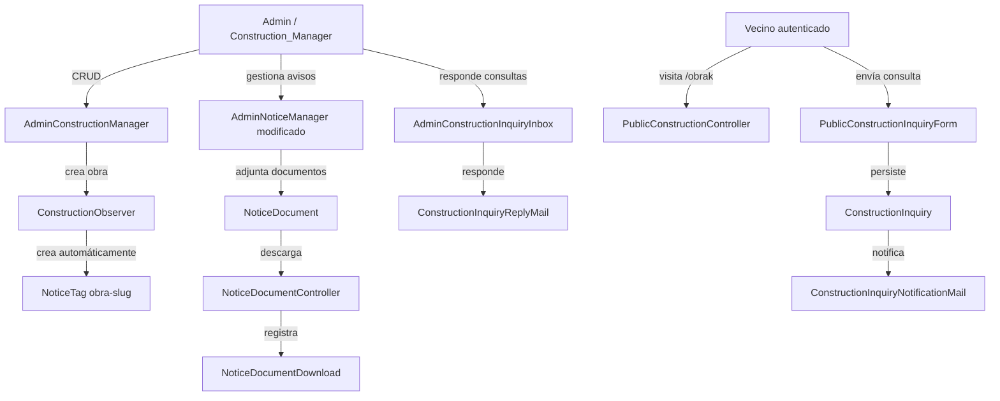

# Documento de Diseño Técnico: Gestión de Obras y Etiquetas en Avisos

## Visión general

Esta feature introduce el sistema de etiquetas para avisos (`NoticeTag`), el nuevo rol `construction_manager`, el modelo `Construction` con su página pública, el sistema de consultas (`ConstructionInquiry`), la asignación de directores de obra, los documentos adjuntos en avisos (`NoticeDocument`) y el tracking de descargas (`NoticeDocumentDownload`).

El diseño se integra en el stack existente: Laravel 13, Livewire 4, Flux UI v2, Pest v4, PHP 8.4. Reutiliza los modelos `Notice`, `NoticeLocation`, `Role`, `User` y los componentes `AdminNoticeManager`, `AdminMessageInbox` y `PublicVotingController` como patrones de referencia.

---

## Arquitectura



---

## Componentes e interfaces

### Modificaciones a modelos existentes

**`Role`** — añadir constante y registrar en `names()`:

```php
public const CONSTRUCTION_MANAGER = 'construction_manager';

public static function names(): array
{
    return [
        self::SUPER_ADMIN,
        self::GENERAL_ADMIN,
        self::COMMUNITY_ADMIN,
        self::PROPERTY_OWNER,
        self::DELEGATED_VOTE,
        self::CONSTRUCTION_MANAGER,
    ];
}
```

**`Notice`** — añadir relaciones:

```php
public function tag(): BelongsTo  // → NoticeTag (nullable)
public function documents(): HasMany  // → NoticeDocument
```

**`User`** — añadir métodos:

```php
public function canManageConstructions(): bool
{
    return $this->hasAnyRole([
        Role::SUPER_ADMIN,
        Role::GENERAL_ADMIN,
        Role::CONSTRUCTION_MANAGER,
    ]);
}

// Modificar canManageNotices() para incluir CONSTRUCTION_MANAGER:
public function canManageNotices(): bool
{
    return $this->hasAnyRole([
        Role::SUPER_ADMIN,
        Role::GENERAL_ADMIN,
        Role::COMMUNITY_ADMIN,
        Role::CONSTRUCTION_MANAGER,
    ]);
}

// Relación con obras asignadas:
public function constructions(): BelongsToMany  // → Construction (tabla pivote construction_user)
```

**`canAccessAdminPanel()`** — incluir `CONSTRUCTION_MANAGER`:

```php
public function canAccessAdminPanel(): bool
{
    return $this->hasAnyRole([
        Role::SUPER_ADMIN,
        Role::GENERAL_ADMIN,
        Role::COMMUNITY_ADMIN,
        Role::CONSTRUCTION_MANAGER,
    ]);
}
```

### Observer

**`ConstructionObserver`** (`app/Observers/ConstructionObserver.php`)

En el evento `created`, crea automáticamente la `NoticeTag` vinculada:

```php
public function created(Construction $construction): void
{
    NoticeTag::create([
        'slug'    => 'obra-' . $construction->slug,
        'name_eu' => 'Obra: ' . $construction->title,
        'name_es' => 'Obra: ' . $construction->title,
    ]);
}
```

### Controladores

**`PublicConstructionController`** — patrón `PublicVotingController`:

```php
class PublicConstructionController extends Controller
{
    public function index(): View         // lista obras activas
    public function show(string $slug): View  // detalle de obra + avisos de su Construction_Tag
}
```

**`NoticeDocumentController`**:

```php
class NoticeDocumentController extends Controller
{
    // GET /notice-documents/{token}
    // Sirve el fichero, registra NoticeDocumentDownload, controla acceso público/privado
    public function download(string $token): Response|RedirectResponse
}
```

El token es un UUID almacenado en `notice_documents.token` (campo adicional, único, generado al crear el documento). Evita exponer IDs secuenciales.

### Política de autorización

**`ConstructionPolicy`**:

```php
class ConstructionPolicy
{
    public function viewAny(User $user): bool;  // canManageConstructions()
    public function create(User $user): bool;   // canManageConstructions()
    public function update(User $user, Construction $construction): bool;  // canManageConstructions()
    public function delete(User $user, Construction $construction): bool;  // solo superadmin/admin_general
}
```

**`NoticeTagPolicy`**:

```php
class NoticeTagPolicy
{
    public function create(User $user): bool;  // solo superadmin/admin_general
    public function update(User $user): bool;  // solo superadmin/admin_general
    public function delete(User $user): bool;  // solo superadmin/admin_general
}
```

### Componentes Livewire

**`AdminNoticeManager`** (modificación) — añadir:

- Propiedad `$selectedTagId` (nullable int) para el selector de etiqueta.
- En `rules()`: validar `selectedTagId` según rol (Construction_Manager solo puede usar sus Construction_Tags).
- En `render()`: cargar `noticeTags` disponibles según rol + total de descargas por aviso (`withCount` o subquery).
- Métodos `uploadDocument()`, `removeDocument()`, `toggleDocumentPublic()` para gestión de adjuntos.
- En el listado: mostrar badge de etiqueta y total de descargas; al expandir, desglose por documento.

**`AdminConstructionManager`** (`app/Livewire/AdminConstructionManager.php`):

- CRUD completo de obras (título, descripción, starts_at, ends_at, is_active).
- Selector de Construction_Managers asignados (solo visible para superadmin/admin_general).
- Paginación, búsqueda, ordenación por `starts_at`.

**`AdminConstructionInquiryInbox`** (`app/Livewire/AdminConstructionInquiryInbox.php`):

- Patrón visual idéntico a `AdminMessageInbox`.
- Filtro por obra (Construction_Manager solo ve sus obras; superadmin ve todas).
- Respuesta inline: campo `reply` con botón de envío que dispara `ConstructionInquiryReplyMail`.
- Indicador visual de respondida/no respondida.

**`PublicConstructionInquiryForm`** (`app/Livewire/PublicConstructionInquiryForm.php`):

- Formulario con campos: name, email, subject, message.
- Pre-rellena name y email del usuario autenticado.
- Al enviar: persiste `ConstructionInquiry`, despacha `ConstructionInquiryNotificationMail` a cada Construction_Manager de la obra.

### Mails

**`ConstructionInquiryNotificationMail`** — notificación al Construction_Manager:

```php
class ConstructionInquiryNotificationMail extends Mailable
{
    use Queueable, SerializesModels;

    public function __construct(
        public readonly ConstructionInquiry $inquiry,
        public readonly Construction $construction,
    ) {}
}
```

**`ConstructionInquiryReplyMail`** — respuesta al vecino:

```php
class ConstructionInquiryReplyMail extends Mailable
{
    use Queueable, SerializesModels;

    public function __construct(
        public readonly ConstructionInquiry $inquiry,
    ) {}
}
```

### Rutas

En `routes/public.php`, dentro de los grupos `eu` y `es`:

```php
// Grupo eu
Route::get('/obrak', [PublicConstructionController::class, 'index'])
    ->middleware('auth')->name('constructions.eu');
Route::get('/obrak/{slug}', [PublicConstructionController::class, 'show'])
    ->middleware('auth')->name('constructions.show.eu');

// Grupo es
Route::get('/obras', [PublicConstructionController::class, 'index'])
    ->middleware('auth')->name('constructions.es');
Route::get('/obras/{slug}', [PublicConstructionController::class, 'show'])
    ->middleware('auth')->name('constructions.show.es');

// Sin prefijo de locale (token-based, no necesita localización)
Route::get('/notice-documents/{token}', [NoticeDocumentController::class, 'download'])
    ->name('notice-documents.download');
```

En `routes/private.php`, dentro del grupo `admin`:

```php
Route::get('/obras', fn() => view('admin.constructions'))
    ->middleware('role:superadmin,admin_general,construction_manager')
    ->name('constructions');
Route::get('/consultas-obras', fn() => view('admin.construction-inquiries'))
    ->middleware('role:superadmin,construction_manager')
    ->name('construction-inquiries');
```

---

## Modelos de datos

### Esquema ER

```mermaid
erDiagram
    notices ||--o| notice_tags : "tiene (notice_tag_id)"
    notice_tags ||--o{ notices : "etiqueta"
    constructions ||--|| notice_tags : "genera (obra-slug)"
    constructions ||--o{ construction_inquiries : "recibe"
    constructions }o--o{ users : "construction_user"
    notices ||--o{ notice_documents : "adjunta"
    notice_documents ||--o{ notice_document_downloads : "registra"
    users ||--o{ notice_document_downloads : "descarga (nullable)"
    users ||--o{ construction_inquiries : "envía (nullable)"

    notice_tags {
        bigint id PK
        string slug UK
        string name_eu
        string name_es nullable
        timestamps
        softDeletes
    }

    notices {
        bigint id PK
        bigint notice_tag_id FK nullable
        string slug
        string title_eu
        string title_es nullable
        text content_eu
        text content_es nullable
        boolean is_public
        timestamp published_at nullable
        timestamps
        softDeletes
    }

    constructions {
        bigint id PK
        string title
        string slug UK
        text description nullable
        date starts_at
        date ends_at nullable
        boolean is_active
        timestamps
        softDeletes
    }

    construction_user {
        bigint construction_id FK
        bigint user_id FK
        timestamps
    }

    construction_inquiries {
        bigint id PK
        bigint construction_id FK
        bigint user_id FK nullable
        string name
        string email
        string subject
        text message
        text reply nullable
        timestamp replied_at nullable
        boolean is_read
        timestamp read_at nullable
        timestamps
        softDeletes
    }

    notice_documents {
        bigint id PK
        bigint notice_id FK
        string token UK
        string filename
        string path
        string mime_type
        bigint size_bytes
        boolean is_public
        timestamps
        softDeletes
    }

    notice_document_downloads {
        bigint id PK
        bigint notice_document_id FK
        bigint user_id FK nullable
        string ip_address
        timestamp downloaded_at
    }
```

### Migraciones

1. `create_notice_tags_table` — tabla `notice_tags` con `slug` (unique), `name_eu`, `name_es` (nullable), softDeletes.
2. `add_notice_tag_id_to_notices_table` — añade `notice_tag_id` (nullable FK a `notice_tags`) a `notices`.
3. `create_constructions_table` — tabla `constructions` con todos los campos + softDeletes.
4. `create_construction_user_table` — tabla pivote `construction_user` con `construction_id`, `user_id`, timestamps.
5. `create_construction_inquiries_table` — tabla `construction_inquiries` con todos los campos + softDeletes.
6. `create_notice_documents_table` — tabla `notice_documents` con `token` (unique), todos los campos + softDeletes.
7. `create_notice_document_downloads_table` — tabla `notice_document_downloads` **sin** softDeletes.

### Modelos

**`NoticeTag`**:

```php
class NoticeTag extends Model
{
    use SoftDeletes;

    protected $fillable = ['slug', 'name_eu', 'name_es'];

    public function notices(): HasMany { ... }  // → Notice

    // Accessor bilingüe (patrón ResolvesLocalizedAttributes)
    public function getNameAttribute(): string { ... }
}
```

**`Construction`**:

```php
class Construction extends Model
{
    use SoftDeletes;

    protected $fillable = ['title', 'slug', 'description', 'starts_at', 'ends_at', 'is_active'];

    protected $casts = [
        'starts_at' => 'date',
        'ends_at'   => 'date',
        'is_active' => 'boolean',
    ];

    public function managers(): BelongsToMany  // → User (tabla construction_user)
    public function inquiries(): HasMany       // → ConstructionInquiry
    public function tag(): HasOne             // → NoticeTag (via slug obra-{slug})

    // Scope obras activas: starts_at <= today AND (ends_at >= today OR ends_at IS NULL)
    public function scopeActive(Builder $query): Builder { ... }
}
```

**`ConstructionInquiry`**:

```php
class ConstructionInquiry extends Model
{
    use SoftDeletes;

    protected $fillable = [
        'construction_id', 'user_id', 'name', 'email',
        'subject', 'message', 'reply', 'replied_at', 'is_read', 'read_at',
    ];

    protected $casts = [
        'is_read'    => 'boolean',
        'read_at'    => 'datetime',
        'replied_at' => 'datetime',
    ];

    public function construction(): BelongsTo { ... }
    public function user(): BelongsTo { ... }  // nullable
}
```

**`NoticeDocument`**:

```php
class NoticeDocument extends Model
{
    use SoftDeletes;

    protected $fillable = [
        'notice_id', 'token', 'filename', 'path', 'mime_type', 'size_bytes', 'is_public',
    ];

    protected $casts = ['is_public' => 'boolean', 'size_bytes' => 'integer'];

    public function notice(): BelongsTo { ... }
    public function downloads(): HasMany { ... }  // → NoticeDocumentDownload
}
```

**`NoticeDocumentDownload`** (sin SoftDeletes — evento inmutable):

```php
class NoticeDocumentDownload extends Model
{
    public $timestamps = false;

    protected $fillable = [
        'notice_document_id', 'user_id', 'ip_address', 'downloaded_at',
    ];

    protected $casts = ['downloaded_at' => 'datetime'];

    public function document(): BelongsTo { ... }
    public function user(): BelongsTo { ... }  // nullable
}
```

---

## Propiedades de corrección

_Una propiedad es una característica o comportamiento que debe mantenerse verdadero en todas las ejecuciones válidas del sistema — esencialmente, una declaración formal sobre lo que el sistema debe hacer. Las propiedades sirven como puente entre las especificaciones legibles por humanos y las garantías de corrección verificables por máquina._

### Propiedad 1: Unicidad de slug en NoticeTag

_Para cualquier_ nombre de etiqueta que produzca un slug ya existente en la base de datos, el intento de crear una nueva `NoticeTag` con ese nombre debe ser rechazado con un error de validación de unicidad.

**Valida: Requisitos 1.3, 1.4**

### Propiedad 2: Etiquetas disponibles según rol

_Para cualquier_ usuario con rol `construction_manager` asignado a N obras, el conjunto de etiquetas seleccionables al crear/editar un aviso debe ser exactamente las N `Construction_Tags` de esas obras (slugs `obra-{slug}`), sin incluir ninguna otra etiqueta del sistema.

**Valida: Requisito 2.3**

### Propiedad 3: Autorización de etiqueta en aviso

_Para cualquier_ `construction_manager` y cualquier `NoticeTag` que no pertenezca a una obra que tiene asignada, intentar guardar un aviso con esa etiqueta debe resultar en un error de autorización (HTTP 403).

**Valida: Requisito 2.4**

### Propiedad 4: canManageConstructions por rol

_Para cualquier_ usuario del sistema, `canManageConstructions()` debe retornar `true` si y solo si el usuario tiene al menos uno de los roles `superadmin`, `admin_general` o `construction_manager`.

**Valida: Requisitos 5.6, 10.6**

### Propiedad 5: Validación de fechas de obra

_Para cualquier_ par de fechas (`starts_at`, `ends_at`) donde `ends_at` no es nulo y es anterior a `starts_at`, la validación de la obra debe fallar; para cualquier par donde `ends_at` es nulo o posterior/igual a `starts_at`, la validación debe pasar.

**Valida: Requisito 6.4**

### Propiedad 6: Observer crea Construction_Tag automáticamente

_Para cualquier_ obra creada con un título arbitrario, debe existir exactamente una `NoticeTag` con slug `obra-{slug-de-la-obra}` inmediatamente después de la creación.

**Valida: Requisito 6.7**

### Propiedad 7: Filtro de obras activas

_Para cualquier_ conjunto de obras con fechas variadas, el scope `active()` debe retornar exactamente las obras donde `starts_at <= hoy` y (`ends_at >= hoy` o `ends_at` es null), sin incluir ninguna obra fuera de ese rango.

**Valida: Requisito 7.1**

### Propiedad 8: Validación del formulario de consulta

_Para cualquier_ combinación de valores de los campos `name`, `email`, `subject`, `message`, la validación debe rechazar el formulario si algún campo obligatorio está vacío o si `email` no tiene formato válido, y aceptarlo únicamente cuando todos los campos son válidos.

**Valida: Requisitos 8.2, 8.3**

### Propiedad 9: Validación de documentos adjuntos

_Para cualquier_ fichero subido, la validación debe rechazarlo si su tipo MIME no está en `{application/pdf, application/vnd.openxmlformats-officedocument.wordprocessingml.document, application/vnd.openxmlformats-officedocument.spreadsheetml.sheet, image/jpeg, image/png}` o si su tamaño supera 20 MB, y aceptarlo en caso contrario.

**Valida: Requisitos 11.2, 11.3**

### Propiedad 10: Tracking de descargas

_Para cualquier_ descarga de un `NoticeDocument` (por usuario autenticado o anónimo), debe existir exactamente un registro `NoticeDocumentDownload` con el `notice_document_id` correcto, el `user_id` del usuario autenticado (o null si anónimo), la IP de la petición y la fecha de descarga.

**Valida: Requisitos 12.1, 12.2**

---

## Manejo de errores

| Escenario                                            | Comportamiento                                                         |
| ---------------------------------------------------- | ---------------------------------------------------------------------- |
| Slug de NoticeTag duplicado                          | Error de validación con mensaje indicando que el nombre ya está en uso |
| Construction_Manager usa etiqueta no autorizada      | HTTP 403 en `saveNotice()`                                             |
| Obra no encontrada o inactiva en `/obrak/{slug}`     | HTTP 404                                                               |
| Usuario no autenticado en `/obrak` o `/obrak/{slug}` | Redirección al login (middleware `auth`)                               |
| Usuario no autenticado descarga documento privado    | Redirección al login                                                   |
| Fichero adjunto con tipo MIME no permitido           | Error de validación con lista de formatos aceptados                    |
| Fichero adjunto supera 20 MB                         | Error de validación indicando el límite                                |
| Token de descarga inválido                           | HTTP 404                                                               |
| ends_at anterior a starts_at                         | Error de validación en formulario de obra                              |
| Respuesta a consulta ya respondida                   | Sobrescribe `reply` y actualiza `replied_at`                           |

---

## Estrategia de testing

### Enfoque dual

- **Tests unitarios** (`tests/Unit/`) — lógica pura sin base de datos: validaciones de fechas, `canManageConstructions()`, generación de slug de Construction_Tag, validación de tipos MIME y tamaño de fichero.
- **Tests de feature** (`tests/Feature/`) — flujos HTTP, Livewire, políticas de autorización, observer, tracking de descargas.

### Librería de property-based testing

Se usa **Pest v4** nativo con `fake()` para generación aleatoria de datos y `->repeat(2)` en tests con entradas aleatorias. No se requieren dependencias adicionales.

Formato de etiqueta para cada test de propiedad:

```
// Feature: construction-management, Property N: <texto de la propiedad>
```

### Tests de propiedad (un test por propiedad)

| Propiedad                         | Archivo                                                | Descripción                                                    |
| --------------------------------- | ------------------------------------------------------ | -------------------------------------------------------------- |
| P1: Unicidad slug NoticeTag       | `tests/Unit/NoticeTagSlugUniquenessTest.php`           | Genera nombres que producen slugs duplicados, verifica rechazo |
| P2: Etiquetas disponibles por rol | `tests/Unit/ConstructionManagerTagsTest.php`           | Genera managers con N obras, verifica conjunto de etiquetas    |
| P3: Autorización etiqueta         | `tests/Feature/ConstructionManagerNoticeAuthTest.php`  | Genera etiquetas no asignadas, verifica HTTP 403               |
| P4: canManageConstructions        | `tests/Unit/UserCanManageConstructionsTest.php`        | Genera usuarios con roles aleatorios, verifica retorno         |
| P5: Validación fechas obra        | `tests/Unit/ConstructionDateValidationTest.php`        | Genera pares de fechas, verifica validación                    |
| P6: Observer Construction_Tag     | `tests/Feature/ConstructionObserverTest.php`           | Genera obras con títulos aleatorios, verifica NoticeTag creada |
| P7: Filtro obras activas          | `tests/Unit/ConstructionActiveScopeTest.php`           | Genera obras con fechas variadas, verifica scope               |
| P8: Validación consulta           | `tests/Unit/ConstructionInquiryValidationTest.php`     | Genera combinaciones de campos, verifica validación            |
| P9: Validación documentos         | `tests/Unit/NoticeDocumentValidationTest.php`          | Genera tipos MIME y tamaños, verifica validación               |
| P10: Tracking descargas           | `tests/Feature/NoticeDocumentDownloadTrackingTest.php` | Genera descargas autenticadas y anónimas, verifica registro    |

### Tests de ejemplo (feature/integration)

- `tests/Feature/PublicConstructionControllerTest.php` — rutas `/obrak`, `/obrak/{slug}`, acceso auth, 404.
- `tests/Feature/AdminConstructionManagerLivewireTest.php` — CRUD de obras, asignación de managers.
- `tests/Feature/AdminConstructionInquiryInboxLivewireTest.php` — listado, apertura, respuesta, filtro por rol.
- `tests/Feature/NoticeDocumentAccessTest.php` — acceso público vs privado, token inválido.
- `tests/Feature/AdminNoticeManagerDocumentsTest.php` — upload, toggle público/privado, eliminación, contador descargas.
