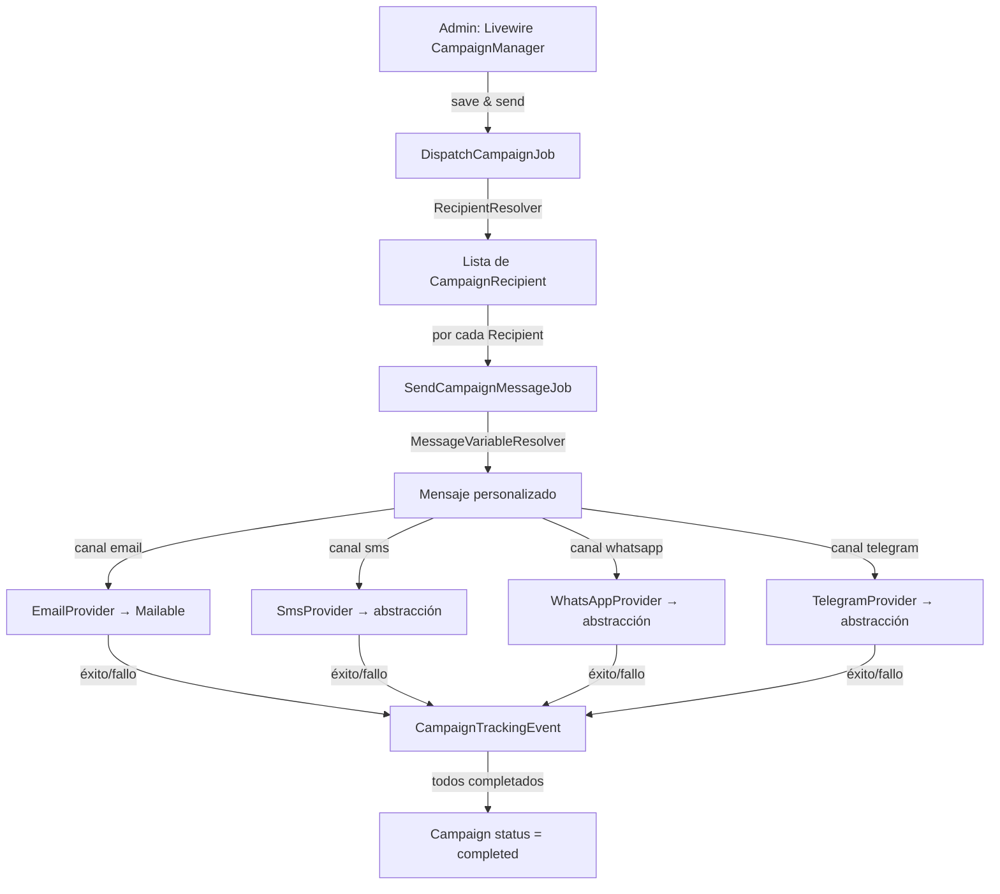

# Documento de Diseño Técnico: Mass Messaging

## Visión general

El sistema de mensajería masiva permite a los administradores componer campañas de comunicación multicanal (email, SMS, WhatsApp, Telegram) dirigidas a propietarias de la comunidad. Los mensajes admiten variables de personalización, soporte bilingüe (eu/es), documentos adjuntos con control de acceso y tracking completo de interacciones (aperturas, clics, descargas).

El diseño se integra en el stack existente: Laravel 13, Livewire 4, Flux UI v2, Pest v4, PHP 8.4. Reutiliza los modelos `Owner`, `Property`, `PropertyAssignment` y `Location` ya existentes, y sigue los patrones establecidos en `AdminNoticeManager` y `VotingConfirmationMail`.

---

## Arquitectura

El flujo de envío sigue una arquitectura de tres capas:

1. **Capa de composición** — Componente Livewire donde el admin crea/edita la Campaign.
2. **Capa de despacho** — `DispatchCampaignJob` resuelve destinatarios y encola un `SendCampaignMessageJob` por Recipient.
3. **Capa de entrega** — `SendCampaignMessageJob` sustituye variables, selecciona idioma y delega en el `ChannelProvider` correspondiente.



### Tracking

```mermaid
flowchart LR
    Email -->|pixel 1x1| TR[GET /track/open/{token}]
    Email -->|enlace| TC[GET /track/click/{token}?url=...]
    Email/Doc -->|descarga| TD[GET /track/doc/{token}/{docId}]
    TR & TC & TD --> TE[CampaignTrackingEvent]
```

---

## Componentes e interfaces

### Interfaces de canal

```php
// app/Contracts/Messaging/ChannelProvider.php
interface ChannelProvider
{
    public function send(CampaignRecipient $recipient, string $subject, string $body): void;
}

// app/Contracts/Messaging/SmsProvider.php
interface SmsProvider extends ChannelProvider {}

// app/Contracts/Messaging/WhatsAppProvider.php
interface WhatsAppProvider extends ChannelProvider {}

// app/Contracts/Messaging/TelegramProvider.php
interface TelegramProvider extends ChannelProvider {}

// app/Contracts/Messaging/EmailProvider.php
interface EmailProvider extends ChannelProvider {}
```

La implementación concreta de SMS y WhatsApp se definirá cuando se elija el proveedor. Se registrará en `AppServiceProvider` mediante binding de interfaz. `EmailProvider` se implementa con `CampaignMail` (Mailable de Laravel).

### Servicio de resolución de destinatarios

```php
// app/Services/Messaging/RecipientResolver.php
class RecipientResolver
{
    /**
        * Resuelve los Owners que cumplen el filtro y genera CampaignRecipient
        * para cada contacto válido (coprop1 y coprop2) según el canal.
        *
        * @return Collection<int, array{owner_id: int, slot: string, contact: string}>
        */
    public function resolve(Campaign $campaign): Collection;
}
```

Lógica de filtrado:

- `all` → todos los Owners con `activeAssignments` y contacto válido para el canal.
- `portal:{code}` → Owners cuya propiedad activa pertenece al Location con ese código y tipo `portal`.
- `garage:{code}` → ídem con tipo `garage`.

Para cada Owner se generan hasta dos entradas: `coprop1` (si tiene contacto) y `coprop2` (si tiene contacto).

### Servicio de sustitución de variables

```php
// app/Services/Messaging/MessageVariableResolver.php
class MessageVariableResolver
{
    /**
        * Sustituye todas las variables **nombre_variable** en el texto
        * por los valores del Owner/Recipient correspondiente.
        */
    public function resolve(string $text, Owner $owner, string $slot): string;
}
```

Variables soportadas:

| Variable        | Valor                                                                 |
| --------------- | --------------------------------------------------------------------- |
| `**nombre**`    | `coprop1_name` o `coprop2_name` según slot                            |
| `**propiedad**` | Nombres de propiedades activas separados por coma                     |
| `**portal**`    | Códigos de Location únicos de propiedades activas, separados por coma |

Variables sin valor → cadena vacía. Ningún marcador `**...**` residual en el resultado final.

### Jobs

```php
// app/Jobs/Messaging/DispatchCampaignJob.php
class DispatchCampaignJob implements ShouldQueue
{
    public function __construct(public readonly int $campaignId) {}

    public function handle(RecipientResolver $resolver): void;
    // 1. Carga Campaign, cambia status a 'sending'
    // 2. Resuelve Recipients con RecipientResolver
    // 3. Crea CampaignRecipient por cada uno con token único
    // 4. Encola SendCampaignMessageJob por cada CampaignRecipient
}

// app/Jobs/Messaging/SendCampaignMessageJob.php
class SendCampaignMessageJob implements ShouldQueue
{
    public function __construct(public readonly int $recipientId) {}

    public function handle(MessageVariableResolver $resolver): void;
    // 1. Carga CampaignRecipient con Campaign y Owner
    // 2. Selecciona idioma según preferred_locale
    // 3. Sustituye variables en asunto y cuerpo
    // 4. Delega en ChannelProvider correspondiente
    // 5. Registra éxito/fallo en CampaignTrackingEvent
    // 6. Si todos los recipients están procesados → Campaign status = 'completed'
}
```

### Controladores de tracking

```php
// app/Http/Controllers/Messaging/TrackingController.php
class TrackingController extends Controller
{
    // GET /track/open/{token}  → registra 'open', devuelve pixel 1x1 transparente
    public function open(string $token): Response;

    // GET /track/click/{token}  → registra 'click', redirige a ?url=
    public function click(string $token, Request $request): RedirectResponse;

    // GET /track/doc/{token}/{document}  → registra 'download', sirve fichero
    public function document(string $token, CampaignDocument $document): Response;
}
```

Tokens inválidos → HTTP 404 sin revelar información de la Campaign.

### Política de autorización

```php
// app/Policies/CampaignPolicy.php
class CampaignPolicy
{
    public function viewAny(User $user): bool;   // superadmin, admin_general, admin_comunidad
    public function create(User $user): bool;    // ídem
    public function update(User $user, Campaign $campaign): bool;  // solo en draft
    public function delete(User $user, Campaign $campaign): bool;  // solo en draft
    public function send(User $user, Campaign $campaign): bool;    // verifica filtro vs managedLocations
    public function duplicate(User $user, Campaign $campaign): bool;
}
```

Reglas de `send` para `admin_comunidad`:

- Filtro `all` → denegado (403).
- Filtro `portal:{code}` o `garage:{code}` → permitido solo si el Location está en `managedLocations`.

### Componentes Livewire

**`AdminCampaignManager`** (`app/Livewire/AdminCampaignManager.php`)

- Lista paginada de Campaigns con columnas: asunto, canal, filtro, estado, nº recipients, fecha envío, fecha programada.
- Formulario de composición (inline, igual que `AdminNoticeManager`): asunto eu/es, cuerpo eu/es, canal, filtro, adjuntos, fecha/hora de envío programado (opcional), selector de plantilla.
- Contador en tiempo real de recipients válidos al cambiar canal o filtro, desglosado por coprop1/coprop2.
- Acciones: crear, editar (solo draft/scheduled), eliminar (solo draft/scheduled), duplicar, enviar, programar, cancelar programación.
- Previsualización con variables sustituidas por valores de ejemplo.
- Advertencia cuando el filtro no produce ningún recipient.

**`AdminCampaignTemplateManager`** (`app/Livewire/AdminCampaignTemplateManager.php`)

- Lista de plantillas con columnas: nombre, canal, fecha de creación.
- Formulario para crear/editar plantilla: nombre, asunto eu/es, cuerpo eu/es, canal.
- Acción eliminar.

### Modelo `CampaignTemplate`

```php
// app/Models/CampaignTemplate.php
class CampaignTemplate extends Model
{
    use SoftDeletes;

    // name, subject_eu, subject_es, body_eu, body_es, channel

    public function createdBy(): BelongsTo { ... }  // User
}
```

Migración: tabla `campaign_templates` con los campos anteriores + `created_by_user_id` FK + softDeletes.

### Campo `scheduled_at` en `Campaign`

Añadir `scheduled_at` (timestamp nullable) a la tabla `campaigns`. El estado `scheduled` se añade al enum de estados: `draft | scheduled | sending | completed | failed`.

El Scheduler de Laravel ejecuta cada minuto:

```php
// app/Console/Commands/DispatchScheduledCampaigns.php
Schedule::command('campaigns:dispatch-scheduled')->everyMinute();
```

El comando busca Campaigns con `status = 'scheduled'` y `scheduled_at <= now()` y despacha `DispatchCampaignJob` para cada una.

**`AdminCampaignDetail`** (`app/Livewire/AdminCampaignDetail.php`)

- Panel de métricas agregadas por Campaign:
    - Total enviados
    - Aperturas únicas + porcentaje sobre total enviados (solo email)
    - Clics únicos + porcentaje sobre total enviados
    - Descargas únicas + porcentaje sobre total enviados
    - Fallos de entrega + porcentaje sobre total enviados
- Tabla de detalle por Recipient con columnas: nombre, contacto, estado de entrega, abierto (sí/no), clics, descargas, última actividad.
- Cada fila expandible para ver el detalle de todos los `CampaignTrackingEvent` del Recipient (tipo, URL/documento, fecha y hora, IP).
- Botón "Reenviar a no abiertos": crea una nueva Campaign en estado `draft` con el mismo contenido, canal y documentos, con los Recipients sin evento `open` como destinatarios, para que el Admin la revise y confirme el envío.

**`AdminInvalidContactsList`** (`app/Livewire/AdminInvalidContactsList.php`)

- Lista de Owners con al menos un contacto marcado como no válido.
- Columnas: nombre de la propietaria, slot (coprop1/coprop2), contacto, canal, errores consecutivos, fecha del último error.
- Acción "Marcar como válido" por fila: resetea el flag `_invalid` y el contador `_error_count` del contacto correspondiente.

## Modelos de datos

### Esquema de base de datos

```mermaid
erDiagram
    owners ||--o{ campaign_recipients : "recibe"
    campaigns ||--o{ campaign_recipients : "tiene"
    campaigns ||--o{ campaign_documents : "adjunta"
    campaign_recipients ||--o{ campaign_tracking_events : "genera"
    campaign_documents ||--o{ campaign_tracking_events : "referencia"
    users ||--o{ campaigns : "crea"
    users ||--o{ campaign_templates : "crea"

    campaigns {
        bigint id PK
        bigint created_by_user_id FK
        bigint template_id FK nullable
        string subject_eu nullable
        string subject_es nullable
        text body_eu nullable
        text body_es nullable
        string channel
        string recipient_filter
        string status
        timestamp scheduled_at nullable
        timestamp sent_at nullable
        timestamps
        softDeletes
    }

    campaign_templates {
        bigint id PK
        bigint created_by_user_id FK
        string name
        string subject_eu nullable
        string subject_es nullable
        text body_eu nullable
        text body_es nullable
        string channel nullable
        timestamps
        softDeletes
    }
    users ||--o{ campaigns : "crea"

    campaigns {
        bigint id PK
        bigint created_by_user_id FK
        string subject_eu nullable
        string subject_es nullable
        text body_eu nullable
        text body_es nullable
        string channel
        string recipient_filter
        string status
        timestamp sent_at nullable
        timestamps
        softDeletes
    }

    campaign_recipients {
        bigint id PK
        bigint campaign_id FK
        bigint owner_id FK
        string slot
        string contact
        string tracking_token
        string status
        text error_message nullable
        timestamps
        softDeletes
    }

    campaign_documents {
        bigint id PK
        bigint campaign_id FK
        string filename
        string path
        string mime_type
        bigint size_bytes
        boolean is_public
        timestamps
        softDeletes
    }

    campaign_tracking_events {
        bigint id PK
        bigint campaign_recipient_id FK
        bigint campaign_document_id FK nullable
        string event_type
        string url nullable
        string ip_address nullable
        timestamps
    }
```

### Modelo `Campaign`

```php
// app/Models/Campaign.php
class Campaign extends Model
{
    use SoftDeletes;

    // status: draft | sending | completed | failed
    // channel: email | sms | whatsapp | telegram
    // recipient_filter: all | portal:{code} | garage:{code}

    public function recipients(): HasMany { ... }
    public function documents(): HasMany { ... }
    public function createdBy(): BelongsTo { ... }  // User
}
```

### Modelo `CampaignRecipient`

```php
// app/Models/CampaignRecipient.php
class CampaignRecipient extends Model
{
    use SoftDeletes;

    // slot: coprop1 | coprop2
    // status: pending | sent | failed
    // tracking_token: 64 hex chars (32 bytes entropía)

    public function campaign(): BelongsTo { ... }
    public function owner(): BelongsTo { ... }
    public function trackingEvents(): HasMany { ... }
}
```

### Modelo `CampaignDocument`

```php
// app/Models/CampaignDocument.php
class CampaignDocument extends Model
{
    use SoftDeletes;

    public function campaign(): BelongsTo { ... }
}
```

### Modelo `CampaignTrackingEvent`

```php
// app/Models/CampaignTrackingEvent.php
class CampaignTrackingEvent extends Model
{
    // Sin SoftDeletes — los eventos de tracking son inmutables
    // event_type: open | click | download

    public function recipient(): BelongsTo { ... }
    public function document(): BelongsTo { ... }  // nullable
}
```

### Migración de modificación de `Owner`

```php
// Añade a la tabla owners:
$table->string('coprop1_telegram_id')->nullable()->after('coprop1_phone');
$table->string('coprop2_telegram_id')->nullable()->after('coprop2_phone');
$table->string('preferred_locale', 2)->nullable()->after('coprop2_telegram_id');
// valores: 'eu' | 'es' | null

// Campos de validez de contacto por canal:
$table->unsignedTinyInteger('coprop1_email_error_count')->default(0);
$table->boolean('coprop1_email_invalid')->default(false);
$table->unsignedTinyInteger('coprop1_phone_error_count')->default(0);
$table->boolean('coprop1_phone_invalid')->default(false);
$table->unsignedTinyInteger('coprop2_email_error_count')->default(0);
$table->boolean('coprop2_email_invalid')->default(false);
$table->unsignedTinyInteger('coprop2_phone_error_count')->default(0);
$table->boolean('coprop2_phone_invalid')->default(false);
$table->timestamp('last_contact_error_at')->nullable();
```

Los campos `_phone_invalid` aplican a SMS, WhatsApp y Telegram (todos usan el teléfono o telegram_id del mismo slot).

### Reset automático de errores al modificar contacto

Se añadirá lógica en `OwnerAuditObserver` (o en un observer dedicado `OwnerContactObserver`) para detectar cambios en los campos de contacto al guardar el Owner:

- Si `coprop1_email` cambia → resetear `coprop1_email_error_count = 0` y `coprop1_email_invalid = false`
- Si `coprop2_email` cambia → resetear `coprop2_email_error_count = 0` y `coprop2_email_invalid = false`
- Si `coprop1_phone` cambia → resetear `coprop1_phone_error_count = 0` y `coprop1_phone_invalid = false`
- Si `coprop2_phone` cambia → resetear `coprop2_phone_error_count = 0` y `coprop2_phone_invalid = false`

Esto se implementa usando `$owner->isDirty('coprop1_email')` en el evento `updating` del Observer.

---

## Propiedades de corrección

_Una propiedad es una característica o comportamiento que debe mantenerse verdadero en todas las ejecuciones válidas del sistema — esencialmente, una declaración formal sobre lo que el sistema debe hacer. Las propiedades sirven como puente entre las especificaciones legibles por humanos y las garantías de corrección verificables por máquina._

### Propiedad 1: Sustitución completa de variables

_Para cualquier_ Owner con datos completos (nombre, propiedades activas con Location), después de aplicar `MessageVariableResolver::resolve()` sobre cualquier texto que contenga variables `**...**`, el resultado no debe contener ningún marcador `**...**` residual.

**Valida: Requisito 3.8**

### Propiedad 2: Selección de idioma según preferred_locale

_Para cualquier_ Owner con `preferred_locale` definido (`eu` o `es`) y Campaign con ambas versiones de idioma disponibles, el mensaje enviado al Recipient debe estar en el idioma que coincide con `preferred_locale`.

**Valida: Requisito 2.2**

### Propiedad 3: Fallback de idioma cuando solo hay una versión

_Para cualquier_ Owner con `preferred_locale=X` y Campaign que solo tiene contenido en el idioma `Y` (distinto de `X`), el sistema debe enviar la versión disponible `Y` sin interrumpir el envío.

**Valida: Requisito 2.4**

### Propiedad 4: Unicidad de tokens de tracking

_Para cualquier_ conjunto de CampaignRecipients generados (independientemente del número de Campaigns o Recipients), todos los `tracking_token` deben ser únicos entre sí y tener al menos 64 caracteres hexadecimales (32 bytes de entropía).

**Valida: Requisito 9.7**

### Propiedad 5: Resolución de destinatarios por filtro de portal/garaje

_Para cualquier_ filtro `portal:{code}` o `garage:{code}`, `RecipientResolver` debe devolver únicamente Owners cuya propiedad activa pertenece al Location con ese código y tipo correspondiente — ningún Owner de otro Location debe aparecer en el resultado.

**Valida: Requisitos 4.2, 4.3**

### Propiedad 6: Generación de Recipients por contactos válidos

_Para cualquier_ Owner con N contactos válidos para el canal seleccionado (0 ≤ N ≤ 2), `RecipientResolver` debe generar exactamente N CampaignRecipients para ese Owner.

**Valida: Requisito 4.4**

### Propiedad 7: Métricas únicas de tracking

_Para cualquier_ conjunto de CampaignTrackingEvents donde el mismo Recipient genera K eventos del mismo tipo, el conteo único de ese tipo de evento para ese Recipient debe ser exactamente 1.

**Valida: Requisito 7.6**

### Propiedad 8: Autorización por rol en filtros de Campaign

_Para cualquier_ usuario con rol `admin_comunidad`, intentar crear o enviar una Campaign con filtro `all` o con un `portal:{code}`/`garage:{code}` no incluido en sus `managedLocations` debe resultar en HTTP 403.

**Valida: Requisitos 9.5, 9.6**

### Propiedad 9: Validación de longitud de asunto

_Para cualquier_ cadena de asunto con longitud > 255 caracteres, la validación debe rechazarla; para cualquier cadena con longitud ≤ 255, debe aceptarla.

**Valida: Requisito 1.4**

---

## Manejo de errores

| Escenario                                   | Comportamiento                                                                                                                                                                                     |
| ------------------------------------------- | -------------------------------------------------------------------------------------------------------------------------------------------------------------------------------------------------- |
| Fallo en envío individual                   | `SendCampaignMessageJob` captura la excepción, registra `CampaignTrackingEvent` con `event_type='error'` y `error_message`, marca el `CampaignRecipient` como `failed`, continúa con el siguiente. |
| Todos los recipients fallan                 | `DispatchCampaignJob` detecta que todos están en `failed` y actualiza `Campaign.status = 'failed'`.                                                                                                |
| Token de tracking inválido                  | `TrackingController` devuelve HTTP 404 sin revelar información de la Campaign.                                                                                                                     |
| Usuario no autenticado en documento privado | Redirige a la ruta de login de Fortify.                                                                                                                                                            |
| Filtro sin destinatarios                    | `RecipientResolver` devuelve colección vacía; el componente Livewire muestra advertencia e impide el envío.                                                                                        |
| Archivo adjunto inválido (tipo/tamaño)      | Validación en Livewire rechaza el upload con mensaje de error.                                                                                                                                     |
| Job fallido por excepción no controlada     | Laravel Queue reintenta según configuración; tras agotar intentos, marca el recipient como `failed`.                                                                                               |

---

## Estrategia de testing

### Enfoque dual

- **Tests unitarios** (`tests/Unit/`): lógica pura sin base de datos — `MessageVariableResolver`, `RecipientResolver` (con mocks), selección de idioma, validación de tokens.
- **Tests de feature** (`tests/Feature/`): flujos HTTP, Livewire, jobs con `Queue::fake()`, políticas de autorización.

### Librería de property-based testing

Se usará **Pest v4** nativo para los tests de propiedades, aprovechando `fake()` para generación aleatoria de datos, datasets para cubrir combinaciones de valores, y `->repeat(2)` en tests con entradas aleatorias. No se requieren dependencias adicionales.

Formato de etiqueta para cada test de propiedad:

```
// Feature: mass-messaging, Property N: <texto de la propiedad>
```

### Tests de propiedad (un test por propiedad)

| Propiedad                        | Archivo                                                | Descripción                                                                  |
| -------------------------------- | ------------------------------------------------------ | ---------------------------------------------------------------------------- |
| P1: Sustitución completa         | `tests/Unit/Messaging/MessageVariableResolverTest.php` | Genera Owners aleatorios con datos completos, verifica ausencia de `**...**` |
| P2: Selección de idioma          | `tests/Unit/Messaging/LocaleSelectionTest.php`         | Genera combinaciones de locale y versiones disponibles                       |
| P3: Fallback de idioma           | `tests/Unit/Messaging/LocaleSelectionTest.php`         | Genera Owners con locale distinto al disponible                              |
| P4: Unicidad de tokens           | `tests/Unit/Messaging/TrackingTokenTest.php`           | Genera N recipients, verifica unicidad y entropía                            |
| P5: Filtro portal/garaje         | `tests/Unit/Messaging/RecipientResolverTest.php`       | Genera Owners en múltiples portales, verifica filtrado                       |
| P6: Recipients por contactos     | `tests/Unit/Messaging/RecipientResolverTest.php`       | Genera Owners con 0/1/2 contactos válidos                                    |
| P7: Métricas únicas              | `tests/Unit/Messaging/TrackingMetricsTest.php`         | Genera K eventos duplicados, verifica count único = 1                        |
| P8: Autorización admin_comunidad | `tests/Feature/Messaging/CampaignPolicyTest.php`       | Genera filtros fuera de managedLocations                                     |
| P9: Validación longitud asunto   | `tests/Unit/Messaging/CampaignValidationTest.php`      | Genera strings de longitud variable alrededor de 255                         |

### Tests de ejemplo (feature/integration)

- `tests/Feature/Messaging/CampaignLifecycleTest.php` — ciclo completo: crear, enviar, completar.
- `tests/Feature/Messaging/TrackingControllerTest.php` — pixel open, click redirect, document download.
- `tests/Feature/Messaging/DocumentAccessTest.php` — acceso público vs privado.
- `tests/Feature/Messaging/CampaignManagerLivewireTest.php` — componente Livewire CRUD.

### Cobertura mínima esperada

- `MessageVariableResolver`: 100% (lógica pura crítica).
- `RecipientResolver`: 100% (lógica pura crítica).
- `CampaignPolicy`: 100% (seguridad).
- `TrackingController`: ≥ 90%.
