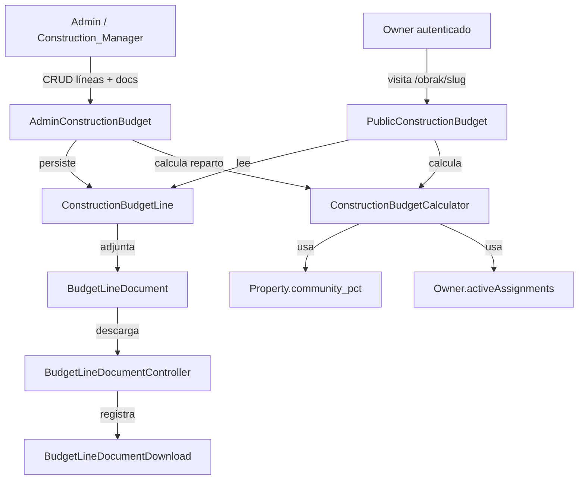

# Documento de Diseño Técnico: Presupuesto de Obra (Construction Budget)

## Visión general

Esta feature añade un sistema de presupuesto a cada obra (`Construction`). El presupuesto se compone de líneas (`ConstructionBudgetLine`) con fecha, descripción, subtotal, IVA y total calculado. Cada línea puede tener documentos privados adjuntos (`BudgetLineDocument`) descargables por token UUID. El panel de administración muestra el reparto del presupuesto por propietario y propiedad según `community_pct`. El frontend `/obrak/{slug}` muestra al propietario autenticado su parte proporcional.

El diseño se integra en el stack existente: Laravel 13, Livewire 4, Flux UI v2, Pest v4, PHP 8.4. Sigue el patrón de `NoticeDocument` / `NoticeDocumentController` de la feature `construction-management` para el acceso por token UUID.

---

## Arquitectura



---

## Componentes e interfaces

### Servicio de cálculo

**`ConstructionBudgetCalculator`** (`app/Support/ConstructionBudgetCalculator.php`):

```php
class ConstructionBudgetCalculator
{
    /** subtotal * (1 + vat_pct / 100), redondeado a 2 decimales */
    public function lineTotal(float $subtotal, float $vatPct): float;

    /** Suma de line_total de líneas no eliminadas */
    public function budgetTotal(Construction $construction): float;

    /** budgetTotal * community_pct / 100, redondeado a 2 decimales */
    public function ownerShare(float $budgetTotal, float $communityPct): float;

    /** Suma de ownerShare por cada propiedad activa del Owner */
    public function ownerTotal(float $budgetTotal, Collection $properties): float;
}
```

### Controlador de descarga

**`BudgetLineDocumentController`** (`app/Http/Controllers/BudgetLineDocumentController.php`):

```php
class BudgetLineDocumentController extends Controller
{
    // GET /budget-documents/{token}
    // Requiere auth. Registra BudgetLineDocumentDownload. Sirve fichero.
    public function download(string $token): Response|RedirectResponse
}
```

El token es el UUID almacenado en `budget_line_documents.token`. Evita exponer IDs secuenciales ni rutas internas.

### Política de autorización

**`ConstructionBudgetPolicy`** (`app/Policies/ConstructionBudgetPolicy.php`):

```php
class ConstructionBudgetPolicy
{
    /** canManageConstructions() + para construction_manager verificar obra asignada */
    public function manage(User $user, Construction $construction): bool;

    /** Solo superadmin / admin_general */
    public function viewReparto(User $user): bool;
}
```

### Componentes Livewire

**`AdminConstructionBudget`** (`app/Livewire/AdminConstructionBudget.php`):

- CRUD de `ConstructionBudgetLine` (añadir, editar, eliminar con confirmación).
- Upload y eliminación de `BudgetLineDocument` por línea.
- Muestra `Budget_Total` en cabecera de sección.
- Sección de reparto por Owner/Property (solo visible si `viewReparto` pasa).
- Contador de descargas por línea y por documento.

**`PublicConstructionBudget`** (`app/Livewire/PublicConstructionBudget.php`):

- Vista de solo lectura para el Owner autenticado en `/obrak/{slug}`.
- Muestra `Budget_Total`, listado de líneas con documentos descargables.
- Muestra `Owner_Share` por propiedad y `Owner_Total`.
- Si el Owner no tiene propiedades activas asignadas, muestra solo `Budget_Total` y líneas.

### Rutas

En `routes/web.php` (o el archivo de rutas público correspondiente):

```php
// Sin prefijo de locale — token-based
Route::get('/budget-documents/{token}', [BudgetLineDocumentController::class, 'download'])
    ->middleware('auth')
    ->name('budget-documents.download');
```

El componente `PublicConstructionBudget` se monta en la vista de detalle de obra existente (`/obrak/{slug}`).

---

## Modelos de datos

### Esquema ER

```mermaid
erDiagram
    constructions ||--o{ construction_budget_lines : "tiene"
    construction_budget_lines ||--o{ budget_line_documents : "adjunta"
    budget_line_documents ||--o{ budget_line_document_downloads : "registra"
    users ||--o{ budget_line_document_downloads : "descarga (nullable)"
    owners ||--o{ property_assignments : "tiene"
    property_assignments }o--|| properties : "asigna"
    properties }o--|| constructions : "participa (via community_pct)"

    constructions {
        bigint id PK
        string title
        string slug UK
        text description nullable
        date starts_at
        date ends_at nullable
        boolean is_active
        timestamps
        softDeletes
    }

    construction_budget_lines {
        bigint id PK
        bigint construction_id FK
        date line_date
        string description
        decimal subtotal "decimal:2"
        decimal vat_pct "decimal:2"
        decimal line_total "decimal:2 calculado"
        timestamps
        softDeletes
    }

    budget_line_documents {
        bigint id PK
        bigint construction_budget_line_id FK
        string token UK "UUID"
        string filename
        string path
        string mime_type
        bigint size_bytes
        timestamps
        softDeletes
    }

    budget_line_document_downloads {
        bigint id PK
        bigint budget_line_document_id FK
        bigint user_id FK nullable
        string ip_address
        timestamp downloaded_at
    }

    owners {
        bigint id PK
        bigint user_id FK
    }

    properties {
        bigint id PK
        decimal community_pct "decimal:4"
    }

    property_assignments {
        bigint id PK
        bigint property_id FK
        bigint owner_id FK
        date start_date
        date end_date nullable
    }
```

### Migraciones

1. `create_construction_budget_lines_table` — tabla `construction_budget_lines` con FK a `constructions`, campos de fecha/descripción/importes, softDeletes.
2. `create_budget_line_documents_table` — tabla `budget_line_documents` con FK a `construction_budget_lines`, `token` (unique), campos de fichero, softDeletes.
3. `create_budget_line_document_downloads_table` — tabla `budget_line_document_downloads` con FK a `budget_line_documents` y `users` (nullable), `ip_address`, `downloaded_at`. **Sin** softDeletes, **sin** timestamps automáticos.

### Modelos

**`ConstructionBudgetLine`**:

```php
class ConstructionBudgetLine extends Model
{
    use SoftDeletes;

    protected $fillable = [
        'construction_id', 'line_date', 'description',
        'subtotal', 'vat_pct', 'line_total',
    ];

    protected function casts(): array
    {
        return [
            'line_date'  => 'date',
            'subtotal'   => 'decimal:2',
            'vat_pct'    => 'decimal:2',
            'line_total' => 'decimal:2',
        ];
    }

    public function construction(): BelongsTo  // → Construction
    public function documents(): HasMany       // → BudgetLineDocument (sin soft-deleted por defecto)
}
```

**`BudgetLineDocument`**:

```php
class BudgetLineDocument extends Model
{
    use SoftDeletes;

    protected $fillable = [
        'construction_budget_line_id', 'token', 'filename',
        'path', 'mime_type', 'size_bytes',
    ];

    protected function casts(): array
    {
        return ['size_bytes' => 'integer'];
    }

    // token se genera automáticamente en el observer o boot()
    public function budgetLine(): BelongsTo  // → ConstructionBudgetLine
    public function downloads(): HasMany     // → BudgetLineDocumentDownload
}
```

**`BudgetLineDocumentDownload`** (sin SoftDeletes — evento inmutable):

```php
class BudgetLineDocumentDownload extends Model
{
    public $timestamps = false;

    protected $fillable = [
        'budget_line_document_id', 'user_id', 'ip_address', 'downloaded_at',
    ];

    protected function casts(): array
    {
        return ['downloaded_at' => 'datetime'];
    }

    public function document(): BelongsTo  // → BudgetLineDocument
    public function user(): BelongsTo      // → User (nullable)
}
```

---

## Propiedades de corrección

_Una propiedad es una característica o comportamiento que debe mantenerse verdadero en todas las ejecuciones válidas del sistema — esencialmente, una declaración formal sobre lo que el sistema debe hacer. Las propiedades sirven como puente entre las especificaciones legibles por humanos y las garantías de corrección verificables por máquina._

### Propiedad 1: Cálculo de line_total

_Para cualquier_ combinación de `subtotal` ≥ 0 y `vat_pct` ≥ 0, el valor de `line_total` calculado por `ConstructionBudgetCalculator::lineTotal()` debe ser igual a `round(subtotal * (1 + vat_pct / 100), 2)` y debe ser ≥ 0.

**Valida: Requisitos 1.2, 7.1, 7.6**

### Propiedad 2: Budget_Total excluye líneas con soft delete

_Para cualquier_ obra con N líneas de presupuesto donde M de ellas han sido eliminadas (soft delete), el `Budget_Total` calculado por `ConstructionBudgetCalculator::budgetTotal()` debe ser igual a la suma de `line_total` de las N-M líneas no eliminadas, sin incluir ninguna línea con `deleted_at` no nulo.

**Valida: Requisitos 7.2, 7.5**

### Propiedad 3: Reparto proporcional Owner_Share y Owner_Total

_Para cualquier_ `Budget_Total` ≥ 0 y cualquier Owner con una colección de propiedades activas con `community_pct` arbitrarios, el `Owner_Share` de cada propiedad debe ser `round(Budget_Total * community_pct / 100, 2)` y el `Owner_Total` debe ser la suma exacta de todos sus `Owner_Share`.

**Valida: Requisitos 4.3, 4.4, 7.3, 7.4**

### Propiedad 4: Soft delete en cascada línea → documentos

_Para cualquier_ `ConstructionBudgetLine` con N `BudgetLineDocument` asociados, al aplicar soft delete a la línea todos sus documentos deben recibir `deleted_at` no nulo, sin que ningún documento quede activo.

**Valida: Requisito 1.6**

### Propiedad 5: Validación de tipo MIME de documentos

_Para cualquier_ tipo MIME, la validación de `BudgetLineDocument` debe aceptarlo si y solo si pertenece al conjunto `{application/pdf, application/vnd.openxmlformats-officedocument.wordprocessingml.document, application/vnd.openxmlformats-officedocument.spreadsheetml.sheet, image/jpeg, image/png}`, y rechazar cualquier otro tipo con un error de validación.

**Valida: Requisitos 2.2, 2.3, 2.4**

### Propiedad 6: Tracking de descargas

_Para cualquier_ `BudgetLineDocument` y usuario autenticado, después de una descarga debe existir exactamente un `BudgetLineDocumentDownload` con el `budget_line_document_id` correcto, el `user_id` del usuario, la IP de la petición y `downloaded_at` no nulo.

**Valida: Requisito 8.2**

### Propiedad 7: Autorización de Construction_Manager por obra asignada

_Para cualquier_ usuario con rol `construction_manager` y cualquier obra que no tiene asignada, cualquier intento de gestionar el presupuesto de esa obra (crear, editar o eliminar líneas o documentos) debe ser rechazado con HTTP 403.

**Valida: Requisito 6.3**

---

## Manejo de errores

| Escenario                                      | Comportamiento                                                 |
| ---------------------------------------------- | -------------------------------------------------------------- |
| Token de descarga inválido o no encontrado     | HTTP 404                                                       |
| Usuario no autenticado solicita descarga       | Redirección al login (middleware `auth`)                       |
| Construction_Manager gestiona obra no asignada | HTTP 403                                                       |
| Fichero con MIME no permitido                  | Error de validación con lista de formatos aceptados            |
| Fichero supera 20 MB                           | Error de validación indicando el límite                        |
| Campo obligatorio vacío o inválido en línea    | Errores de validación Livewire sin persistir                   |
| `subtotal` o `vat_pct` negativos               | Error de validación (`min:0`)                                  |
| Obra sin propiedades activas asignadas         | Mensaje informativo en sección de reparto                      |
| Owner sin propiedades activas en la obra       | Muestra solo `Budget_Total` y líneas, omite reparto individual |

---

## Estrategia de testing

### Enfoque dual

- **Tests unitarios** (`tests/Unit/`) — lógica pura sin base de datos: `ConstructionBudgetCalculator` (los tres métodos de cálculo), validación de MIME, validación de campos de línea.
- **Tests de feature** (`tests/Feature/`) — flujos HTTP, Livewire, políticas de autorización, tracking de descargas, soft delete en cascada.

### Librería de property-based testing

Se usa **Pest v4** nativo con `fake()` para generación aleatoria de datos y `->repeat(2)` en tests con entradas aleatorias. No se requieren dependencias adicionales.

Formato de etiqueta para cada test de propiedad:

```
// Feature: construction-budget, Property N: <texto de la propiedad>
```

### Tests de propiedad (un test por propiedad)

| Propiedad                             | Archivo                                                      | Descripción                                                                        |
| ------------------------------------- | ------------------------------------------------------------ | ---------------------------------------------------------------------------------- |
| P1: Cálculo line_total                | `tests/Unit/ConstructionBudgetCalculatorLineTotalTest.php`   | Genera subtotal y vat_pct aleatorios, verifica fórmula y no-negatividad            |
| P2: Budget_Total excluye soft-deleted | `tests/Unit/ConstructionBudgetCalculatorBudgetTotalTest.php` | Genera líneas con algunas eliminadas, verifica suma correcta                       |
| P3: Reparto proporcional              | `tests/Unit/ConstructionBudgetCalculatorRepartoTest.php`     | Genera Budget_Total y community_pct aleatorios, verifica Owner_Share y Owner_Total |
| P4: Soft delete en cascada            | `tests/Feature/ConstructionBudgetLineSoftDeleteTest.php`     | Genera líneas con N documentos, elimina línea, verifica documentos eliminados      |
| P5: Validación MIME                   | `tests/Unit/BudgetLineDocumentMimeValidationTest.php`        | Genera tipos MIME aleatorios, verifica aceptación/rechazo                          |
| P6: Tracking descargas                | `tests/Feature/BudgetLineDocumentDownloadTrackingTest.php`   | Genera descargas autenticadas, verifica registro correcto                          |
| P7: Autorización CM por obra          | `tests/Feature/ConstructionBudgetAuthorizationTest.php`      | Genera CM con obras asignadas y no asignadas, verifica 403                         |

### Tests de ejemplo (feature/integration)

- `tests/Feature/BudgetLineDocumentControllerTest.php` — token inválido → 404, no autenticado → login, autenticado → fichero servido.
- `tests/Feature/AdminConstructionBudgetLivewireTest.php` — CRUD de líneas, upload de documentos, visibilidad de sección de reparto según rol.
- `tests/Feature/PublicConstructionBudgetLivewireTest.php` — Owner con propiedades activas ve reparto, Owner sin propiedades ve solo totales.
