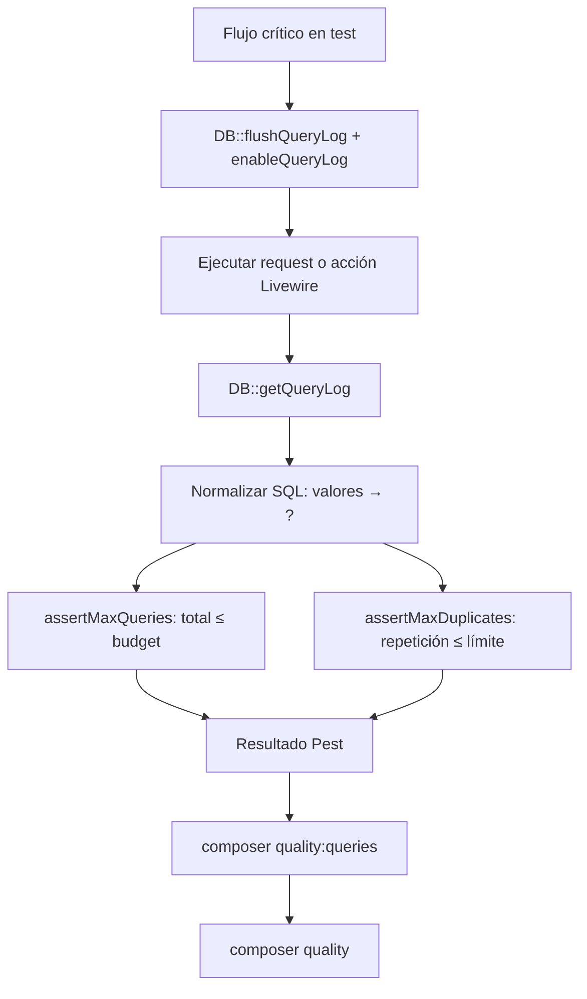

# Documento de Diseño Técnico: Quality DB Query Guard

## Visión general

Se añade una capa de tests Pest orientada a rendimiento SQL que reutiliza capacidades nativas de Laravel (`DB::enableQueryLog` / `DB::getQueryLog`) sin dependencias adicionales. Los tests viven en `tests/Feature/Performance/` y se ejecutan como script dedicado `quality:queries` integrado en el comando `quality`.

---

## Arquitectura



---

## Componentes

### 1) Helper reutilizable

**`tests/Feature/Performance/QueryGuardHelpers.php`**

```php
<?php

namespace Tests\Feature\Performance;

use Illuminate\Support\Facades\DB;

class QueryGuardHelpers
{
    /**
     * Ejecuta un callable capturando todas las queries lanzadas.
     * Devuelve el query log de Laravel tal como lo devuelve DB::getQueryLog().
     *
     * @return array<int, array{query: string, bindings: array<mixed>, time: float}>
     */
    public static function capture(callable $flow): array
    {
        DB::flushQueryLog();
        DB::enableQueryLog();

        $flow();

        $log = DB::getQueryLog();
        DB::disableQueryLog();

        return $log;
    }

    /**
     * Normaliza una sentencia SQL reemplazando los valores por '?'
     * para poder agrupar sentencias equivalentes.
     */
    public static function normalize(string $sql): string
    {
        // Reemplazar literales de cadena entre comillas
        $sql = preg_replace("/\'[^\']*\'/", '?', $sql) ?? $sql;
        // Reemplazar literales numéricos
        $sql = preg_replace('/\b\d+\b/', '?', $sql) ?? $sql;
        // Normalizar espacios
        return trim(preg_replace('/\s+/', ' ', $sql) ?? $sql);
    }

    /**
     * Agrupa queries por sentencia normalizada y devuelve conteos.
     *
     * @param array<int, array{query: string, bindings: array<mixed>, time: float}> $log
     * @return array<string, int>
     */
    public static function groupByStatement(array $log): array
    {
        $groups = [];
        foreach ($log as $entry) {
            $key = self::normalize($entry['query']);
            $groups[$key] = ($groups[$key] ?? 0) + 1;
        }
        arsort($groups);
        return $groups;
    }

    /**
     * Aserta que el número total de queries no supera el presupuesto.
     *
     * @param array<int, array{query: string, bindings: array<mixed>, time: float}> $log
     */
    public static function assertMaxQueries(array $log, int $budget, string $context = ''): void
    {
        $count = count($log);
        $label = $context ? " [{$context}]" : '';
        expect($count)->toBeLessThanOrEqual(
            $budget,
            "Query budget exceeded{$label}: {$count} queries executed, expected ≤ {$budget}"
        );
    }

    /**
     * Aserta que ninguna sentencia normalizada se repite más de $maxPerStatement veces.
     *
     * @param array<int, array{query: string, bindings: array<mixed>, time: float}> $log
     */
    public static function assertMaxDuplicates(array $log, int $maxPerStatement = 2, string $context = ''): void
    {
        $groups = self::groupByStatement($log);
        $violations = array_filter($groups, fn (int $count) => $count > $maxPerStatement);

        if (empty($violations)) {
            expect(true)->toBeTrue();
            return;
        }

        $label = $context ? " [{$context}]" : '';
        $summary = collect($violations)
            ->map(fn (int $c, string $sql) => "  ({$c}x) " . substr($sql, 0, 120))
            ->implode("\n");

        expect(false)->toBeTrue(
            "Duplicate SQL detected{$label} (limit: {$maxPerStatement}x per statement):\n{$summary}"
        );
    }
}
```

### 2) Suite de tests Query Guard

**Ubicación:** `tests/Feature/Performance/`

Estrategia:
- 3 flujos de alta prioridad en la primera fase.
- Presupuesto inicial calculado con baseline real + margen del 20%.
- Cada test incluye comentario con el porqué del umbral.

### 3) Cambio en composer.json

Nuevo script `quality:queries`:
```json
"quality:queries": [
    "php artisan test --compact tests/Feature/Performance"
]
```

Orden actualizado de `quality`:
```json
"quality": [
    "@lint:check",
    "@analyse",
    "@quality:phpmd",
    "@quality:queries"
]
```

---

## Decisiones de diseño

1. **Sin paquetes extra** — Ya existe la capacidad nativa de query log en Laravel. Evita añadir complejidad al proyecto.
2. **Presupuestos por flujo** — Control más fino y menos falsos positivos que un límite global.
3. **Normalización propia** — Simple regex: suficiente para detectar repeticiones evidentes sin sobreingeniería.
4. **Fase incremental** — Empezar con 3 flujos de alto riesgo histórico y ampliar según necesidad.

---

## Flujos críticos iniciales

| Flujo                      | Componente           | Riesgo principal                      |
| -------------------------- | -------------------- | ------------------------------------- |
| Listado admin propietarios | `Admin\Owners`       | N+1 user/owner/assignments/properties |
| Listado admin anuncios     | `AdminNoticeManager` | N+1 notice+locations                  |
| Listado admin mensajes     | `AdminMessageInbox`  | duplicadas por read-filter            |

---

## Riesgos y mitigaciones

- **Riesgo**: tests frágiles por variaciones de seed/datos.
    - **Mitigación**: datos de test deterministas con factory explícita por escenario.
- **Riesgo**: umbrales demasiado ajustados.
    - **Mitigación**: baseline real + margen del 20% y revisión al cambiar lógica de carga.
- **Riesgo**: aumento del tiempo de `quality`.
    - **Mitigación**: limitar suite inicial a pocos flujos y medir con `--compact`.
